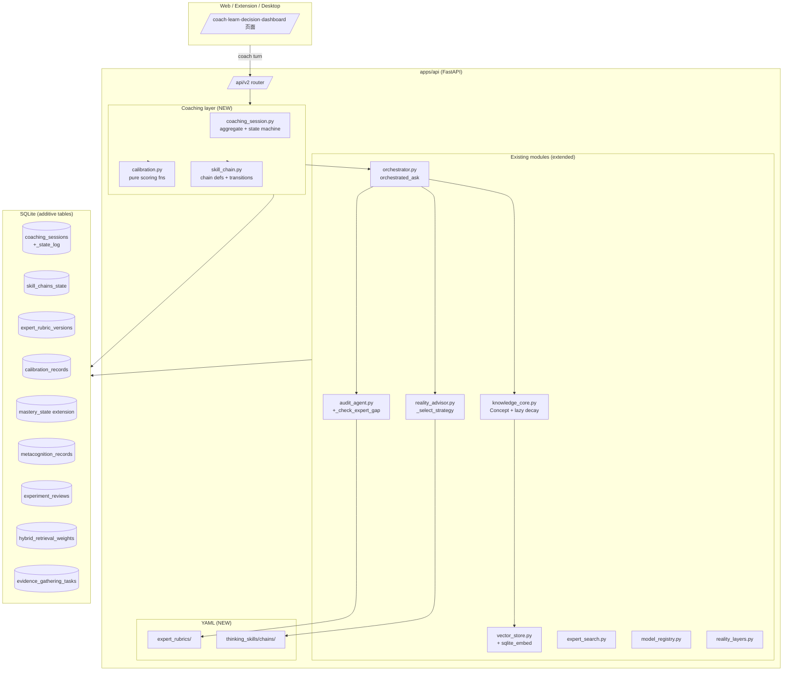
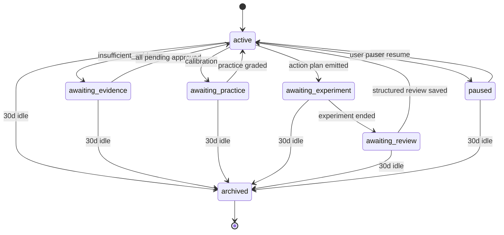

# Design Document — `expert-coaching-loop`

## Overview

`expert-coaching-loop` 把 Reality OS 升级为"陪伴初学者向顶级专家成长"的知识管理 Agent。它在不破坏既有架构的前提下，把 18 项需求 (R1–R18) 落地为以下七大新能力：

1. **CoachingSession aggregate** (R1) — 一个跨 HTTP 请求持久化的状态机，把 `UserProfile / Diagnosis / ClassifiedEvidence / ActionExperiment / LearningReview / DecisionLog` 串成一条学习闭环。
2. **Expert Rubric × Gap Score** (R2) — 在现有 `audit_agent.zero_context_audit` 5 维度上新增 `_check_expert_gap` 第六维，由 YAML 驱动并版本化。
3. **Skill Chain** (R3) — 把 `reality_advisor._select_strategy` 升级为返回有顺序的 Skill 链 + 入/出条件 + 切换策略，复用 `apps/api/thinking_skills/`。
4. **Calibration Loop** (R4) — `DecisionLog` 强制收集 `predicted_outcome + confidence`，复盘时计算 Brier / Log loss / 校准曲线。
5. **Mastery Graph + SM-2** (R5, R9) — `Concept` 增加 `mastery_score / next_due_at / decay_lambda`，提供纯函数 `sm2_update / decay`，实验复盘硬绑定到 mastery 更新。
6. **Active Evidence Gathering** (R6) — `verification.insufficient_evidence=true` 自动派遣 `expert_search`，结果落 `pending_knowledge`，未审批前禁止下发 verdict。
7. **Metacognition / Embedding / Dashboard** (R7, R8, R10) — 元认知钩子 + 向量层 + 跨域类比 + 学习仪表板。

横切要求 (R11–R18) 通过既有 `pending-review / dry-run / Supervisor_Approval / current_context / audit_log / i18n / .env.example` 模式实现，**不引入新模式**。

### 设计原则

- **Additive only**：所有改动在现有模块上扩展函数和字段；旧入口保持向后兼容。
- **Pure functions first**：算法核心 (SM-2、decay、Brier、calibration_curve、hybrid retrieval score、skill chain 转移、expert gap、metacognition score) 与存储解耦，便于 PBT (R17)。
- **Pending-review default**：所有新写路径默认 `pending-review` 或 `dry-run`，与 R11 一致。
- **Tenant scoping**：每张新表 `tenant_id NOT NULL`，每个查询走 `current_context(request)`，与 R12 一致。
- **Server-only secrets**：embedder slot 沿用 `model_registry.ModelSlot`，受 `REALITY_OS_EMBED_MODE ∈ {online, offline, disabled}` 约束 (R8, R15, R18)。
- **Legacy untouched**：`legacy/` 不被读写 (R16)。

---

## Architecture

### 高层分层



### Coach Turn 数据流

`POST /api/v2/coach/turn` 在 `orchestrated_ask` 中按以下顺序运行（**扩展，不替换**）：

```mermaid
flowchart LR
    A[input] --> B[CoachingSession.load_or_create]
    B --> C[Orchestrator.orchestrated_ask]
    C --> D[RealityAdvisor.advise<br/>+SkillChain selection]
    D --> E[Retrieval<br/>FTS+TFIDF+embed]
    E --> F[Generate / Scaffold]
    F --> G[Audit<br/>5dims+_check_expert_gap]
    G --> H{verification<br/>insufficient?}
    H -- yes --> I[Active Evidence Gathering<br/>expert_search → pending_knowledge]
    I --> J[block verdict]
    H -- no --> K[update mastery / calibration]
    K --> L[CoachingSession.transition]
    L --> M[next_action ∈ {learn,practice,experiment,review}]
    M --> N[response with AdapterMetadata.mode]
```

关键点：
- **R1.9** 强调 *扩展* `orchestrated_ask` 而非新建 orchestrator；CoachingSession 是 aggregate，调用 `orchestrated_ask` 并把会话上下文注入 `task_contract`。
- **R2.3** 把 `_check_expert_gap` 嵌进 audit 步骤；缺 rubric 时按 R2.5 退化为 5 维。
- **R6** 的闭环由 `evidence_gathering_tasks` 表驱动，`DecisionLog.verdict` 在所有 pending 被 approve 之前保持空。
- 每个状态转移、mastery 更新、calibration 记录都走 `core._record_audit` (R13)。

### CoachingSession state machine



合法转移之外的请求按 R1.2 拒绝 (HTTP 409)。每次转移写 `coaching_session_state_log` 并发 `event_type="coaching_session_transition"` (R13.1)。

### `next_action` 决策规则 (R1.5 + R4.5)

| 条件 | 选择 |
|---|---|
| `confidence_band=insufficient` 且 `Active Evidence Gathering` 已发起 | `awaiting_evidence` |
| `mastery_score(any due concept) < pass_threshold` | `practice` |
| `calibration_score < 0.6` 且最近 10 turn 无校准记录 | `practice` (校准练习) |
| `Skill_Chain.exit_conditions` 都满足且仍有未跑步骤 | `experiment` |
| 上一个 experiment 未 review | `review` |
| 否则 | `learn` |

---

## Components and Interfaces

### 新增模块

| 模块 | 路径 | 职责 |
|---|---|---|
| CoachingSession aggregate | `apps/api/app/coaching_session.py` | aggregate root + state machine + repository (R1) |
| Calibration | `apps/api/app/calibration.py` | 纯函数 `brier_score / log_loss / calibration_curve` (R4, R17) |
| Skill Chain | `apps/api/app/skill_chain.py` | YAML loader + 转移函数 + 切换策略 (R3) |
| Expert Rubric loader | `apps/api/app/expert_rubric.py` | YAML loader + 版本表 + `_check_expert_gap` 实现 (R2) |
| Active Evidence Gathering | `apps/api/app/evidence_gathering.py` | 闭环驱动器 (R6) |
| Metacognition | `apps/api/app/metacognition.py` | `confidence_check` / `questions_you_didnt_ask` / 评分 (R7) |
| Mastery scheduler | `apps/api/app/mastery.py` | `sm2_update / decay` 纯函数 + lazy-on-read 写回 (R5) |
| Hybrid retrieval scorer | `apps/api/app/hybrid_retrieval.py` | `score = w_fts·f + w_tfidf·t + w_embed·c` 的合并函数 (R8, R17) |
| Feature flags | `apps/api/app/feature_flags.py` | dark-launch flag reader (rollout) |
| Audit events catalog | `apps/api/app/audit_events.py` | event_type 常量集合 (R13) |
| Adapter metadata helper | `apps/api/app/adapter_metadata.py` (or extend `schemas.py`) | `make_metadata(mode=...)` (R11) |

### 现有模块的增量

| 模块 | 增量 | 关联需求 |
|---|---|---|
| `orchestrator.orchestrated_ask` | 新增 `coaching_session_id / coach_turn=True / user_confidence_check` 参数；turn 完成后调 `CoachingSession.transition` | R1.9, R1.5 |
| `reality_advisor.RealityAdvisor.advise` | `AdvisorResponse` 加字段 `skill_chain={"id","step_idx","step_skill_id"}` | R3.2 |
| `audit_agent.zero_context_audit` | 新增 dimension `"expert_gap"` | R2.2, R2.3 |
| `knowledge_core.Concept` | 新字段 `mastery_score, last_practiced_at, next_due_at, decay_lambda, ef, repetition, interval_days, domain` | R5.1, R5.6 |
| `knowledge_core.search` | 把 `vector_store.search` 的结果与 FTS/TFIDF 走 `hybrid_retrieval.combine` 合并 | R8.2, R8.3 |
| `vector_store.py` | 新增 `SqliteEmbedVectorStore` 实现 | R8.4–R8.6 |
| `expert_search.expert_search` | 接受新参数 `seed_claim / coach_turn_id / decision_log_id` | R6.1, R6.2 |
| `reality_layers.ActionExperiment.review` | 改成结构化 `{result_class, key_metrics[], notes}` | R9.1 |

### 新增 / 扩展端点

```
POST   /api/v2/coach/turn                 # R1.3-1.4, R1.10
GET    /api/v2/coach/sessions/{id}        # R1.7
POST   /api/v2/coach/sessions/{id}/archive
POST   /api/v2/concepts/{id}/analogies    # R8.3
POST   /api/v2/practice/{concept_id}/grade# R5.2
POST   /api/v2/decisions                  # R4.1
POST   /api/v2/decisions/{id}/review      # R4.2
POST   /api/v2/experiments/{id}/review    # R9.1
POST   /api/v2/rubrics/check              # R2.2 (admin)
GET    /api/v2/rubrics                    # R2.6
GET    /api/v2/dashboard/mastery          # R10.1.a
GET    /api/v2/dashboard/calibration      # R10.1.b
GET    /api/v2/dashboard/skill-chain      # R10.1.c
GET    /api/v2/dashboard/decay            # R10.1.d
```

所有新端点：`Depends(require_api_context)` + tenant scoping (R12.2)。响应顶层带 `metadata: AdapterMetadata`，`metadata.mode ∈ {pending-review, dry-run, mock-safe, read-only}` (R11.5)。

#### Endpoint × mode 对照

| 端点 | mode | 备注 |
|---|---|---|
| `POST /coach/turn` | `dry-run` 当 turn 触发 high-risk 工具，否则 `mock-safe` | R11.3 |
| `POST /concepts/{id}/analogies` | `read-only` | — |
| `GET  /coach/sessions/{id}` | `read-only` | — |
| `POST /coach/sessions/{id}/archive` | `mock-safe` | — |
| `POST /practice/{concept}/grade` | `pending-review` | R11.1 |
| `POST /decisions` | `pending-review`；verdict 字段强制空直到 R6 闭环 | R6.3, R11.1 |
| `POST /decisions/{id}/review` | `pending-review` | R11.1 |
| `POST /experiments/{id}/review` | `pending-review` | R9.1, R9.2 |
| `POST /rubrics/check` | `dry-run` | R11.5 |
| `GET  /rubrics` | `read-only` | — |
| `GET  /dashboard/*` | `read-only` | — |

---

## Data Models

所有新表都加在已有 SQLite 之上，**不删不改任何现有表/列**，新列以 `ADD COLUMN ... DEFAULT ...` 形式叠加 (R12.1, R16)。

### 1. `coaching_sessions`

| 列 | 类型 | 约束 |
|---|---|---|
| `id` | TEXT | PK `cs_<hex12>` |
| `tenant_id` | TEXT | NOT NULL, indexed |
| `user_id` | TEXT | NOT NULL |
| `profile_id` | TEXT | NOT NULL |
| `state` | TEXT | NOT NULL CHECK in 7 states |
| `current_chain_id` | TEXT |  |
| `current_step_idx` | INTEGER | DEFAULT 0 |
| `last_action` | TEXT |  |
| `consecutive_failures` | INTEGER | DEFAULT 0 |
| `created_at` / `updated_at` / `last_turn_at` | TEXT | NOT NULL |
| `archived_at` | TEXT |  |

Indexes: `(tenant_id, state)`, `(tenant_id, last_turn_at)`.

### 2. `coaching_session_state_log`

`(id, session_id, tenant_id, from_state, to_state, actor, reason, payload_json, created_at)`. Index `(session_id, created_at)`.

### 3. `skill_chains_state`

`(session_id, chain_id, step_idx, entry_state_json, exit_evaluated_at, tenant_id, updated_at)`, PK `(session_id, chain_id)`.

### 4. `expert_rubric_versions`

`(id, tenant_id, domain, version, author, source, cited_evidence_ids_json, loaded_at, status, refused_reason)`, UNIQUE `(domain, version)`.

### 5. `calibration_records`

`(id, tenant_id, decision_log_id, predicted_outcome, confidence, binary_resolved, binary_value, brier_score, log_loss, created_at, reviewed_at)`. Index `(tenant_id, reviewed_at)`.

### 6. Mastery extension on `concepts`

```sql
ALTER TABLE concepts ADD COLUMN mastery_score    REAL    NOT NULL DEFAULT 0.0;
ALTER TABLE concepts ADD COLUMN last_practiced_at TEXT;
ALTER TABLE concepts ADD COLUMN next_due_at      TEXT;
ALTER TABLE concepts ADD COLUMN decay_lambda     REAL    NOT NULL DEFAULT 0.05;
ALTER TABLE concepts ADD COLUMN domain           TEXT;
ALTER TABLE concepts ADD COLUMN ef               REAL    NOT NULL DEFAULT 2.5;
ALTER TABLE concepts ADD COLUMN repetition       INTEGER NOT NULL DEFAULT 0;
ALTER TABLE concepts ADD COLUMN interval_days    REAL    NOT NULL DEFAULT 0.0;
```

`mastery_history`: `(id, tenant_id, concept_id, prev_score, next_score, source, grade, created_at)`.

### 7. `metacognition_records`

`(id, tenant_id, session_id, turn_id, user_confidence, system_confidence, questions_engaged, questions_total, outcome_observed, created_at)`.

### 8. `experiment_reviews`

`(id, tenant_id, experiment_id, result_class CHECK in (success|partial|fail), key_metrics_json, metric_breach, notes, created_at)`.

### 9. `hybrid_retrieval_weights`

`(tenant_id PK, w_fts, w_tfidf, w_embed, updated_at)`. Defaults `(0.4, 0.3, 0.3)`.

### 10. `evidence_gathering_tasks`

`(id, tenant_id, session_id, coach_turn_id, decision_log_id, state, claim, pending_knowledge_ids_json, created_at, updated_at)`.

### 11. `concept_prerequisites`

`(parent_concept_id, child_concept_id, tenant_id, weight)`, PK `(parent_concept_id, child_concept_id)`.

### Migration plan

启动时 `KnowledgeCore._init_schema()` 走：
1. `CREATE TABLE IF NOT EXISTS …` 全部新表。
2. 对 `concepts` / `knowledge_items` 用 `pragma table_info` 检查后 `ADD COLUMN`。
3. 写 `schema_version` 行 `expert_coaching_loop_v1`。

---

## Audit log event_type catalogue (R13)

| event_type | trigger | payload keys |
|---|---|---|
| `coaching_session.created` | new session | `session_id, profile_id` |
| `coaching_session_transition` | state change | `from_state, to_state, session_id, reason, actor` |
| `coaching_session.archived` | timeout or manual | `session_id, reason` |
| `mastery_update` | SM-2 / decay / exp review | `concept_id, prev, next, source, grade?` |
| `calibration_record` | predict / review | `decision_log_id, brier?, log_loss?` |
| `rubric_check` | rubric load / refuse / apply | `domain, version, status, cited_evidence_ids` |
| `skill_chain.advance` | step idx +1 | `session_id, chain_id, prev_idx, next_idx` |
| `skill_chain.switch` | chain change | `session_id, from_chain, to_chain, trigger_reason` |
| `evidence_gathering.*` | R6 transitions | `task_id, state` |
| `experiment_review.recorded` | review submit | `experiment_id, result_class` |
| `metacognition.recorded` | confidence_check captured | `session_id, turn_id` |

---

## Algorithms

### 1. SM-2 update (R5.2, R17.1)

```python
@dataclass(frozen=True)
class MasteryState:
    mastery_score: float
    ef: float
    repetition: int
    interval_days: float
    last_practiced_at: datetime
    next_due_at: datetime
    decay_lambda: float

def sm2_update(grade: int, prev: MasteryState, now: datetime) -> MasteryState:
    """Pure SM-2. Invariants: grade ∈ {0..5}, next_due_at >= prev.last_practiced_at,
    decay_lambda > 0, mastery_score ∈ [0,1], ef >= 1.3."""
    assert 0 <= grade <= 5
    if grade < 3:
        n_next = 0
        I_next = 1.0
    else:
        if prev.repetition == 0:
            I_next = 1.0
        elif prev.repetition == 1:
            I_next = 6.0
        else:
            I_next = prev.interval_days * prev.ef
        n_next = prev.repetition + 1
    ef_next = max(1.3, prev.ef + (0.1 - (5 - grade) * (0.08 + (5 - grade) * 0.02)))
    g_norm = grade / 5.0
    mastery_next = max(0.0, min(1.0, 0.6 * prev.mastery_score + 0.4 * g_norm))
    lam_next = max(1e-4, 0.5 / max(1.0, I_next))
    return MasteryState(
        mastery_score=mastery_next, ef=ef_next, repetition=n_next,
        interval_days=I_next, last_practiced_at=now,
        next_due_at=now + timedelta(days=I_next), decay_lambda=lam_next,
    )
```

### 2. Decay (R5.5, R17.3)

```python
def decay(mastery: float, lam: float, dt_days: float) -> float:
    """Exponential decay. Monotonic non-increasing in dt_days."""
    assert 0.0 <= mastery <= 1.0
    assert lam > 0
    dt = max(0.0, dt_days)
    return mastery * math.exp(-lam * dt)
```

### 3. Brier / Log loss / Calibration curve (R4.2, R4.3, R17.2, R17.5)

```python
def brier_score(preds: list[float], outcomes: list[int]) -> float:
    assert len(preds) == len(outcomes) and len(preds) > 0
    return sum((p - o) ** 2 for p, o in zip(preds, outcomes)) / len(preds)

def log_loss(preds: list[float], outcomes: list[int], eps: float = 1e-9) -> float:
    s = 0.0
    for p, o in zip(preds, outcomes):
        p_c = min(1 - eps, max(eps, p))
        s += -(o * math.log(p_c) + (1 - o) * math.log(1 - p_c))
    return s / len(preds)

def calibration_curve(preds, outcomes, bins=10) -> list[CalibrationBin]:
    """Bin into deciles. sum(b.count) == len(preds); each empirical_freq ∈ [0,1]."""
    edges = [i / bins for i in range(bins + 1)]
    out = []
    for i in range(bins):
        lo, hi = edges[i], edges[i + 1]
        in_bin = [(p, o) for p, o in zip(preds, outcomes)
                  if (lo <= p < hi) or (i == bins - 1 and p == 1.0)]
        if not in_bin:
            out.append(CalibrationBin(lo, hi, 0, lo, 0.0))
            continue
        ps, os_ = zip(*in_bin)
        out.append(CalibrationBin(lo, hi, len(in_bin),
                                  sum(ps) / len(ps), sum(os_) / len(in_bin)))
    return out

def calibration_score(records, window=50) -> float:
    resolved = [r for r in records if r.brier_score is not None][-window:]
    if not resolved:
        return 0.0
    return max(0.0, min(1.0, 1.0 - sum(r.brier_score for r in resolved) / len(resolved)))
```

### 4. Skill chain transition (R3, R17.4)

```python
def select_chain(session_state, problem_type, chains):
    """Result.entry_conditions ALL hold under session_state."""
    candidates = [c for c in chains if c.problem_type == problem_type]
    candidates += [c for c in chains if c.problem_type == "general"]
    for chain in candidates:
        if all(p(session_state) for p in chain.entry_conditions):
            return chain
    return next(c for c in chains if c.id == "general_decision")

def transition(state, session_state, failures, *, failure_threshold=2,
               new_problem_type=None, auto_switch=False) -> TransitionResult:
    chain = state.chain
    step = chain.steps[state.step_idx]
    if all(p(session_state) for p in step.exit_conditions):
        if state.step_idx + 1 < len(chain.steps):
            return TransitionResult(advance=True, next_state=state.with_step(state.step_idx + 1))
    if failures >= failure_threshold:
        return _switch(state, session_state, reason="consecutive_failures")
    if new_problem_type and new_problem_type != chain.problem_type:
        if auto_switch:
            return _switch(state, session_state, reason="problem_type_change", new_pt=new_problem_type)
        return TransitionResult(propose_switch=True, new_problem_type=new_problem_type)
    return TransitionResult(repeat=True, next_state=state)
```

### 5. Expert gap scoring (R2.3)

```python
def expert_gap_score(answer_text: str, rubric: ExpertRubric) -> ExpertGap:
    answer_tokens = set(tokenize(answer_text)) - STOPWORDS
    per_dim_scores, missing = [], []
    for dim in rubric.dimensions:
        hits = 0
        for anchor in dim.anchors:
            anchor_tokens = set(tokenize(anchor)) - STOPWORDS
            if anchor_tokens and (answer_tokens & anchor_tokens):
                hits += 1
            else:
                missing.append(f"[{dim.id}] {anchor}")
        per_dim_scores.append((hits / max(len(dim.anchors), 1)) * dim.weight)
    score = max(0.0, min(1.0, sum(per_dim_scores) /
                              max(sum(d.weight for d in rubric.dimensions), 1e-9)))
    return ExpertGap(expert_gap_score=score, missing_points=missing[:7],
                     rubric_id=rubric.id, rubric_version=rubric.version,
                     rubric_source="domain" if rubric.id != "default" else "default")
```

### 6. Hybrid retrieval (R8.2)

```python
def normalize(w: HybridWeights, embed_available: bool) -> HybridWeights:
    weights = (w.w_fts, w.w_tfidf, 0.0 if not embed_available else w.w_embed)
    s = sum(weights)
    if s <= 0:
        return HybridWeights(0.5, 0.5, 0.0)
    return HybridWeights(*(x / s for x in weights))

def hybrid_score(fts_norm, tfidf_norm, cos_norm, weights) -> float:
    return (weights.w_fts * fts_norm + weights.w_tfidf * tfidf_norm
            + weights.w_embed * cos_norm)
```

### 7. Evidence gathering (R6, R17.6)

```python
class GatheringState(str, Enum):
    INSUFFICIENT = "insufficient"
    SEARCHING = "searching"
    PENDING = "pending"
    APPROVED = "approved"
    REJECTED = "rejected"
    CLOSED = "closed_with_reason"

TRANSITIONS = {
    GatheringState.INSUFFICIENT: {GatheringState.SEARCHING, GatheringState.CLOSED},
    GatheringState.SEARCHING:    {GatheringState.PENDING},
    GatheringState.PENDING:      {GatheringState.APPROVED, GatheringState.REJECTED,
                                  GatheringState.SEARCHING, GatheringState.CLOSED},
    GatheringState.APPROVED:     set(),
    GatheringState.REJECTED:     {GatheringState.SEARCHING, GatheringState.CLOSED},
    GatheringState.CLOSED:       set(),
}

def step(task, event):
    if event.target not in TRANSITIONS[task.state]:
        raise ValueError(f"illegal transition {task.state} -> {event.target}")
    return task.with_state(event.target)

def verdict_allowed(task) -> bool:
    return task.state == GatheringState.APPROVED
```

### 8. Metacognition score (R7.4)

```python
def metacognition_score(records) -> float:
    if not records:
        return 0.0
    resolved = [r for r in records if r.outcome_observed is not None
                                    and r.user_confidence is not None]
    calib = (1.0 - sum(abs(r.user_confidence - r.outcome_observed) for r in resolved) / len(resolved)
             if resolved else 0.5)
    eng_records = [r for r in records if r.questions_total > 0]
    eng = (sum(r.questions_engaged / r.questions_total for r in eng_records) / len(eng_records)
           if eng_records else 0.0)
    return max(0.0, min(1.0, 0.6 * calib + 0.4 * eng))
```

---

## Pydantic 契约（关键）

```python
class CoachTurnRequest(BaseModel):
    session_id: str | None = None
    user_message: str = Field(min_length=1)
    language: Literal["zh-CN", "en"] = "zh-CN"
    mode: Literal["simple", "professional"] = "simple"
    confidence_check: float | None = Field(default=None, ge=0.0, le=1.0)

class ExpertGap(BaseModel):
    expert_gap_score: float = Field(ge=0.0, le=1.0)
    missing_points: list[str]
    rubric_id: str
    rubric_version: str
    rubric_source: Literal["domain", "default"]

class SkillChainState(BaseModel):
    chain_id: str
    step_idx: int
    step_skill_id: str
    entry_satisfied: bool
    exit_satisfied: bool

class MetacognitionBlock(BaseModel):
    confidence_check_required: bool
    user_confidence: float | None
    system_confidence: float | None
    questions_you_didnt_ask: list[str]

class CoachTurnResponse(BaseModel):
    metadata: AdapterMetadata
    session_id: str
    session_state: Literal["active","awaiting_evidence","awaiting_practice",
                           "awaiting_experiment","awaiting_review","paused","archived"]
    next_prompt: str
    grounded_evidence: list[dict]
    contradictions: list[dict[str, str]]
    due_practice: list[dict]
    expert_gap: ExpertGap | None
    skill_chain: SkillChainState | None
    next_action: Literal["learn","practice","experiment","review","awaiting_evidence"]
    metacognition: MetacognitionBlock | None
    audit_id: str
    run_id: str

class DecisionLogCreateRequest(BaseModel):
    decision: str
    reasoning: list[str] = []
    evidence_ids: list[str] = []
    predicted_outcome: str = Field(min_length=1)  # required (R4.1)
    confidence: float = Field(ge=0.0, le=1.0)     # required (R4.1)
    review_date: str

class DecisionLogReviewRequest(BaseModel):
    actual_outcome: str
    binary_resolved: bool
    binary_value: bool | None = None
    notes: str = ""

class KeyMetric(BaseModel):
    name: str
    value: float
    unit: str = ""
    target: float | None = None
    target_tolerance: float | None = None

class ExperimentReviewRequest(BaseModel):
    result_class: Literal["success", "partial", "fail"]
    key_metrics: list[KeyMetric] = []
    notes: str = ""

class PracticeGradeRequest(BaseModel):
    grade: int = Field(ge=0, le=5)

class AnalogyHit(BaseModel):
    item_id: str | None
    concept_id: str | None
    title: str
    domain: str
    cosine: float
    snippet: str

class AnalogyResponse(BaseModel):
    metadata: AdapterMetadata
    source_concept_id: str
    source_domain: str
    analogies_available: bool
    hits: list[AnalogyHit]
```

---

## i18n / UI mode

i18n 入口在 `apps/web/lib/i18n.ts`。新功能严格 *additive* 扩展两份字典 (`zhCN`, `enUS`)，包含：

- `coach.next_action.*`
- `coach.expert_gap.title_zh` / `title_en`
- `coach.confidence_check.prompt`
- `coach.metacog.title`
- `coach.skill_chain.step` / `switch_proposed`
- `dash.mastery / calibration / skill_chain / decay`

| Panel | Simple_Mode | Professional_Mode |
|---|---|---|
| Mastery heatmap | ✅ 无筛选 | ✅ + 筛选 |
| Calibration curve | ✅ 仅 score | ✅ bin + Brier/LogLoss |
| Skill-chain completion | ✅ | ✅ + 留存率 |
| Concept decay | ❌ 隐藏 | ✅ |

---

## Security / safety

### Tenant scoping boilerplate

```python
@router.post("/coach/turn", response_model=CoachTurnResponse)
async def coach_turn(payload: CoachTurnRequest, request: Request):
    ctx = current_context(request)                       # R12.2
    repo = CoachingSessionRepo()
    with repo.with_lock(ctx.tenant_id, payload.session_id) as session:
        if session.tenant_id != ctx.tenant_id:           # R1.10, R12.3
            raise HTTPException(404, "session not found")
        result = orchestrated_ask(
            tenant_id=ctx.tenant_id, actor=ctx.user_id,
            coach_turn=True, coaching_session_id=session.id,
            user_confidence_check=payload.confidence_check, ...)
        return CoachTurnResponse(metadata=AdapterMetadata(
            adapter="v2.coach.turn", source_system="apps:api",
            mode="mock-safe", read_only=False), session_id=session.id, ...)
```

### Server-only secrets

- `model_registry.ModelConfig.api_key` 存 `model_registry.api_key_enc`；`to_dict(mask_key=True)` 不返回明文 (R18.4)。
- 新 env：
  - `REALITY_OS_VECTOR_STORE` (default `sqlite_tfidf`)
  - `REALITY_OS_EMBED_MODE ∈ {online, offline, disabled}` (default `disabled`)
  - `REALITY_OS_COACH_AUTOSWITCH=false`
  - `REALITY_OS_CALIBRATION_THRESHOLD=0.6`
  - `REALITY_OS_COACH_IDLE_DAYS=30`
- 启动检测：若 client bundle 暴露 `REALITY_OS_*` 秘密名 → fail-fast + audit `system.misconfiguration` (R15.3)。

---

## Backwards compatibility & rollout

### Feature flags

| Flag | 默认 | 控制 |
|---|---|---|
| `REALITY_OS_COACH_ENABLED` | `false` | `/coach/*` 路由是否注册 |
| `REALITY_OS_HYBRID_RETRIEVAL` | `false` | `KnowledgeCore.search` 是否走 hybrid |
| `REALITY_OS_EXPERT_GAP_ENABLED` | `false` | audit 是否跑第六维 |
| `REALITY_OS_EMBED_MODE` | `disabled` | embedder slot 是否启用 |

### Dark-launch sequence

T+0 schema + 模块 (flags off) → T+7 `EXPERT_GAP_ENABLED` → T+14 `COACH_ENABLED` → T+21 `HYBRID_RETRIEVAL` → T+28 `EMBED_MODE=online`.

### Legacy preservation

`legacy/` 不被新模块 import；`reality_layers.py` 现有 dataclass 保持向后兼容。R16 满足。

---

## Correctness Properties

### Property 1: Coaching state machine validity
*For any* `Coaching_Session` and any attempted transition, `transition` is accepted iff `(from_state, to_state)` is in `ALLOWED`; else raises `ValueError` and persisted state is unchanged.
**Validates: R1.2**

### Property 2: Coaching session round-trip persistence
*For any* session and any writes, persist+reload yields equal aggregate across `(state, current_chain_id, current_step_idx, last_action, mastery snapshot, calibration history, profile_id)`.
**Validates: R1.8**

### Property 3: Idle archival
`archive_idle(idle_days)` transitions to `archived` iff `now - last_turn_at >= idle_days`.
**Validates: R1.6**

### Property 4: Archived state read-allow / write-reject
Archived sessions: every read succeeds; every `Coach_Turn` write is rejected with HTTP 409 and no mutation.
**Validates: R1.7**

### Property 5: Tenant isolation 404
Cross-tenant reads/writes return 404 with body indistinguishable from "not found"; aggregate traversal stays on same `tenant_id`.
**Validates: R1.10, R12.2-4, R10.6**

### Property 6: next_action follows decision table
`decide_next_action` follows the documented table (insufficient → awaiting_evidence; mastery low → practice; calibration low → practice; chain exit met w/ next step → experiment; experiment unreviewed → review; else → learn).
**Validates: R1.5, R4.5**

### Property 7: Rubric loader robustness
Loader (a) refuses + audits `rubric_check status="refused"` on missing fields/unresolved evidence; (b) returns `default.yaml` with `rubric_source="default"` for unknown domain; (c) prior versions remain readable after new version registers.
**Validates: R2.5, R2.6, R2.7**

### Property 8: Expert gap score bounds
`expert_gap_score` ∈ `[0,1]`; `missing_points` length ≤ 7.
**Validates: R2.2, R2.3**

### Property 9: Skill chain transition validity
`transition` advances iff exit_conditions all hold AND has next step; switches iff `failures >= threshold` OR (different problem_type AND auto_switch); every switch lands on a chain whose entry_conditions all hold.
**Validates: R3.3-5, R3.7, R17.4**

### Property 10: SM-2 update invariants
`sm2_update(grade, prev, now)`: `next.next_due_at >= prev.last_practiced_at`, `decay_lambda > 0`, `mastery_score ∈ [0,1]`, `ef >= 1.3`, `repetition = 0 if grade<3 else prev.repetition+1`.
**Validates: R5.2, R5.7, R17.1**

### Property 11: Decay monotonicity
For `dt1 ≤ dt2`: `decay(m, λ, dt1) ≥ decay(m, λ, dt2) ≥ 0`; `decay(m, λ, 0) == m`.
**Validates: R5.5, R17.3**

### Property 12: Brier score bounds and equality
`brier_score(p, o) ∈ [0,1]`; `==0` when every `p[i]∈{0,1}` matches `o[i]`.
**Validates: R4.2, R17.2**

### Property 13: Calibration curve bin invariants
`sum(bin.count) == len(preds)`; every `bin.empirical_freq ∈ [0,1]`; `bin.mean_pred ∈ [bin.lo, bin.hi]` when `count > 0`.
**Validates: R4.3, R17.5**

### Property 14: calibration_score aggregation
Returns value in `[0,1]`; equals `max(0, min(1, 1 - mean(brier of last 50 resolved)))`; returns `0.0` when no resolved record.
**Validates: R4.4**

### Property 15: Active Evidence Gathering closure
Any sequence from `INSUFFICIENT`: legal transitions yield final state in the enum; `verdict_allowed` is `True` iff final == `APPROVED`.
**Validates: R6.1-4, R6.6, R11.4, R17.6**

### Property 16: Pending-review contract
Every successful write to new write endpoints has `metadata.mode ∈ {pending-review, dry-run, mock-safe}`; persisted rows have `status="pending_review"` and `formal_knowledge_write=False` until explicit `approve`.
**Validates: R11.1, R11.2, R11.5**

### Property 17: Hybrid retrieval score linearity and bounds
`normalize` returns weights summing to 1.0 (with `w_embed=0` when `embed_available=False`); `hybrid_score ∈ [0,1]` linear in inputs.
**Validates: R8.2**

### Property 18: Cross-domain analogy ranking
Hits all have `domain != source.domain`; sorted by `cosine` non-increasing.
**Validates: R8.3**

### Property 19: Embedder fallback determinism
When embedder unconfigured / `EMBED_MODE=offline`: no outbound network call; falls back to `SqliteTfidfVectorStore`; `analogies_available=False`; ranking deterministic on stable DB.
**Validates: R8.4, R8.6, R18.2-3**

### Property 20: Real-world result binding
Review with `result_class` emits `mastery_update` per linked Concept with `grade={success:5, partial:3, fail:1}`; `metric_breach=True` iff `|value-target| > tolerance`; K trailing fails triggers chain switch or `human_review_required`.
**Validates: R9.2-4**

### Property 21: Audit event coverage
Each accepted state-changing call emits exactly one audit_log row with documented `event_type` and payload keys; rejected calls emit none.
**Validates: R13.1-4**

### Property 22: Metacognition rules
`questions_you_didnt_ask` length ∈ `[3,7]`; `metacognition_score ∈ [0,1]`; Simple_Mode prompt at most once per UTC day per session; Professional_Mode every significant turn.
**Validates: R7.1, R7.3-4, R7.6**

### Property 23: Topological learn_plan and due-only practice
`learn_plan`: parent-before-child topo order; `retrieval_practice_plan`: `next_due_at <= now()` only.
**Validates: R5.3, R5.4**

### Property 24: Decision log validation
Accepted iff `predicted_outcome` non-empty AND `confidence ∈ [0,1]`; else HTTP 400, no row persisted.
**Validates: R4.1**

### Property 25: API key masking
`ModelConfig.to_dict(mask_key=True)` never returns plaintext key; only `api_key_configured: bool` and `api_key_preview` (≤ 11 chars).
**Validates: R18.4**

---

## Error Handling

| Class | Trigger | HTTP | Behavior |
|---|---|---|---|
| `InvalidStateTransition` | undeclared transition | 409 | `{"detail":"invalid transition", "from_state":…, "to_state":…}` |
| `CrossTenant404` | resource in other tenant | 404 | uniform `{"detail":"not found"}` |
| `ArchivedSessionWrite` | coach turn on archived | 409 | `{"detail":"session archived"}` |
| `RubricRefused` | rubric invalid | continues | audit `rubric_check status="refused"`; degrade to 5 dims |
| `EmbedderUnavailable` | slot off / offline | 200 | `analogies_available=False` |
| `InsufficientEvidence` | verifier insufficient | 200 | `next_action="awaiting_evidence"`; verdict blocked |
| `DecisionLogValidation` | prediction/confidence invalid | 400 | Pydantic error |
| `PendingBlocksMemo` | publish with unresolved pending | 409 | `{"pending_ids":[…]}` |
| `ToolExecutionDisabled` | high-risk tool no approval | 202 | `Supervisor_Approval` dry-run row |
| `MisconfiguredSecret` | client bundle exposes secret | startup fail | audit `system.misconfiguration` |
| `SkillChainValidationError` | chain refs unknown skill | startup fail | route registration skipped |
| `IllegalGatheringTransition` | invalid evidence transition | 500 | logged, task untouched |

---

## Testing Strategy

- **Property-based tests (Hypothesis)** for every pure function and every property above.
- **Example-based unit tests** for endpoint contracts, YAML loaders, UI rendering snapshots.
- **Integration tests** for full `coach/turn` pipeline with stub embedder and deterministic verifier fallback.
- Each property test runs ≥100 iterations (200 for state machines).
- Tag pattern: `# Feature: expert-coaching-loop, Property N: …` `# Validates: Requirements …`.
- PBT suite must complete in ≤60 s; bound list sizes (`max_size=64` for predictions; `max_steps=12` for chain sequences).
- HTTP tests use `TestClient` + tmp SQLite file; vector / model registry calls use `model_registry.reset_registry_for_tests()`.

### Property test sketches

```python
# Property 10 — SM-2
@given(grade=integers(0, 5), prev=mastery_states(), now=datetimes(...))
def test_sm2_update_invariants(grade, prev, now):
    nxt = sm2_update(grade, prev, now)
    assert 0.0 <= nxt.mastery_score <= 1.0
    assert nxt.decay_lambda > 0
    assert nxt.next_due_at >= prev.last_practiced_at
    assert nxt.ef >= 1.3
    assert nxt.repetition == (0 if grade < 3 else prev.repetition + 1)

# Property 11 — decay
@given(m=floats(0, 1), lam=floats(1e-4, 5.0), dt1=floats(0, 365), dt2=floats(0, 365))
def test_decay_monotonic(m, lam, dt1, dt2):
    if dt1 <= dt2:
        assert decay(m, lam, dt1) >= decay(m, lam, dt2) >= 0

# Property 13 — calibration curve
@given(preds=lists(floats(0, 1), min_size=1, max_size=64),
       outs=lists(integers(0, 1), min_size=1, max_size=64))
def test_calibration_curve_invariants(preds, outs):
    n = min(len(preds), len(outs))
    bins = calibration_curve(preds[:n], outs[:n], bins=10)
    assert sum(b.count for b in bins) == n
    assert all(0.0 <= b.empirical_freq <= 1.0 for b in bins)

# Property 15 — evidence gathering
@given(events=lists(gathering_events(), min_size=1, max_size=12))
def test_gathering_closure(events):
    task = GatheringTask(state=GatheringState.INSUFFICIENT, ...)
    final = task
    try:
        for e in events:
            final = step(final, e)
    except ValueError:
        return
    if final.state == GatheringState.APPROVED:
        assert verdict_allowed(final) is True
    else:
        assert verdict_allowed(final) is False
```

---

## Open questions / risks

- **Embedder selection**: 默认 `offline` 走 TF-IDF；`online` 默认本地 `sentence-transformers/all-MiniLM-L6-v2`；OpenAI 等远端 embedder 由用户在 settings 自配 embedder slot。
- **SQLite vs Postgres**: 当前写入量在 SQLite WAL 容量内；Postgres 化作为 R16+ 迁移目标，路径上保留 `KnowledgeCore` 抽象。
- **Rubric authoring**: admin-only `POST /api/v2/rubrics/check` dry-run 校验 + diff；正式发布走 git PR + CI 校验，不允许运行时直写 YAML。
- **Skill chain authoring**: 同上 — 由产品 + 领域专家在 `thinking_skills/chains/` 提交 PR；启动时校验 (R3.7)。
- **Lazy decay vs scheduled job**: 选 lazy on-read + 写时 persist；热读路径多一次 `decay()` 计算可接受。
- **Calibration cold start**: 前 50 条决策 `calibration_score=0.0`，会把 `next_action` 偏向 `practice`；dashboard 可设 `min_samples=10` 阈值隐藏曲线避免误读。
