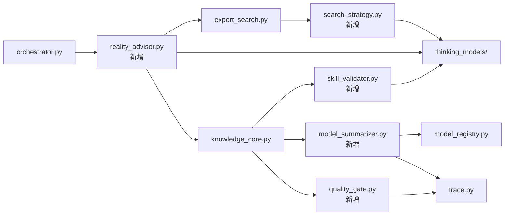

# 技术设计文档：知识系统优化

## Overview

本设计文档描述 Reality OS 知识系统的三大核心优化方向的技术实现方案：

1. **知识入库管线增强** — 在现有 `KnowledgeCore.absorb()` 流程中引入模型辅助总结、Skill 驱动验证和人工监督门控
2. **搜索策略引擎** — 将 `expert_search.py` 中的硬编码搜索逻辑升级为 Skill 驱动的可配置策略系统
3. **混合推理架构** — 增强 `orchestrator.py` 的推理能力，引入上下文感知的动态策略选择

设计原则：
- **向后兼容**：所有现有 API 端点行为不变，新功能通过新参数或新端点暴露
- **优雅降级**：模型 API 不可用时，系统回退到现有确定性逻辑
- **可观测性**：所有新增流程步骤记录到 trace 系统
- **可扩展性**：通过 SKILL.md 文件扩展行为，无需修改代码

## Architecture

### 系统架构图

```mermaid
graph TB
    subgraph "知识入库管线 (Enhanced Absorption Pipeline)"
        A[原始内容] --> B[Clean & Score]
        B --> C{Model Summarizer}
        C -->|成功| D[结构化摘要]
        C -->|失败/未配置| E[确定性摘要]
        D --> F[Skill Validator]
        E --> F
        F -->|Critical| G[Human Review Queue]
        F -->|Warning| H[标记警告 + 入库]
        F -->|Pass| I[正式入库]
        G -->|Approve| I
        G -->|Reject| J[Rejected + Audit Log]
    end

    subgraph "搜索策略引擎 (Search Strategy Engine)"
        K[用户查询] --> L[Intent Signal Matching]
        L --> M{Search Skill 匹配?}
        M -->|是| N[加载 Search Skill]
        M -->|否| O[_infer_sources 回退]
        N --> P[调整源/权重/排序]
        K --> Q{Model 可用?}
        Q -->|是| R[语义扩展查询]
        Q -->|否| S[Tokenize 回退]
        P --> T[执行搜索]
        R --> T
        S --> T
        T --> U[合并去重 + 标注策略]
    end

    subgraph "混合推理 (Hybrid Reasoning)"
        V[用户问题] --> W[Context Anchor + Rules]
        W --> X[Skill Router → 结构化框架]
        X --> Y[User Profile 注入]
        Y --> Z[LLM 生成建议]
        Z --> AA{矛盾检测}
        AA -->|有矛盾| AB[双视角展示]
        AA -->|无矛盾| AC[Level-aware 输出]
        AC --> AD[Trace 记录]
    end
```



### 模块依赖关系



## Components and Interfaces

### 新增模块

#### 1. `model_summarizer.py` — 模型辅助总结器

负责调用 LLM 生成知识摘要，支持优雅降级。

```python
@dataclass
class SummaryResult:
    core_viewpoint: str        # 核心观点
    applicable_scenario: str   # 适用场景
    key_constraints: str       # 关键约束
    full_summary: str          # 完整摘要文本
    model_used: str | None     # 使用的模型名称
    source: Literal["model", "deterministic"]  # 生成来源
    latency_ms: int | None     # 耗时
    token_estimate: float | None  # token 消耗估算
    divergence_score: float    # 与原文的语义偏差 0.0-1.0

class ModelSummarizer:
    def summarize(
        self,
        *,
        title: str,
        body: str,
        source_kind: SourceKind,
        language: str = "zh-CN",
        run_id: str | None = None,
    ) -> SummaryResult:
        """生成结构化摘要。模型不可用时回退到确定性逻辑。"""
        ...

    def summarize_concept(
        self,
        *,
        concept: Concept,
        items: list[KnowledgeItem],
        language: str = "zh-CN",
        run_id: str | None = None,
    ) -> str:
        """为概念节点生成汇总摘要。"""
        ...

    def detect_overlap(
        self,
        *,
        tenant_id: str,
        threshold: float = 0.7,
        run_id: str | None = None,
    ) -> list[tuple[str, str, float]]:
        """识别内容重叠度超过阈值的知识条目对。"""
        ...

    def _deterministic_summary(self, title: str, body: str, language: str) -> SummaryResult:
        """确定性回退：基于 tokenize + 句子权重的摘要。"""
        ...

    def _compute_divergence(self, original: str, summary: str) -> float:
        """计算摘要与原文的语义偏差分数。"""
        ...
```

#### 2. `skill_validator.py` — Skill 驱动验证器

基于 SKILL.md 定义的规则对知识进行结构化验证。

```python
@dataclass
class ValidationDimension:
    name: str  # fact_consistency | timeliness | completeness | source_credibility
    passed: bool
    score: float  # 0.0-1.0
    severity: Literal["critical", "warning", "info", "pass"]
    details: str

@dataclass
class ValidationResult:
    passed: bool
    dimensions: list[ValidationDimension]
    skill_used: str | None  # 使用的验证 Skill ID
    overall_severity: Literal["critical", "warning", "info", "pass"]
    warnings: list[str]
    blocking_issues: list[str]

class SkillValidator:
    def __init__(self, skills_dir: Path | None = None):
        """加载验证 Skill 注册表。"""
        ...

    def validate(
        self,
        *,
        item_title: str,
        item_body: str,
        source_kind: SourceKind,
        tags: list[str],
        existing_items: list[KnowledgeItem] | None = None,
        freshness_date: str | None = None,
        source_url: str | None = None,
    ) -> ValidationResult:
        """执行完整验证流程。"""
        ...

    def _match_skill(self, tags: list[str], source_kind: str) -> str | None:
        """根据领域标签匹配最佳验证 Skill。"""
        ...

    def _check_fact_consistency(
        self, body: str, existing_items: list[KnowledgeItem]
    ) -> ValidationDimension:
        """检查与已有知识的事实一致性。"""
        ...

    def _check_timeliness(self, freshness_date: str | None) -> ValidationDimension:
        """检查时效性。"""
        ...

    def _check_completeness(self, title: str, body: str) -> ValidationDimension:
        """检查关键字段完整性。"""
        ...

    def _check_source_credibility(
        self, source_kind: str, source_url: str | None
    ) -> ValidationDimension:
        """检查来源可信度。"""
        ...

    def reload_skills(self) -> int:
        """重新加载验证 Skill（支持热更新）。"""
        ...
```

#### 3. `quality_gate.py` — 人工监督门控

管理知识审核流程和批量操作。

```python
@dataclass
class ReviewItem:
    id: str
    tenant_id: str
    knowledge_item_id: str
    title: str
    original_body: str
    model_summary: str | None
    divergence_score: float
    validation_result: ValidationResult
    status: Literal["pending_review", "approved", "rejected"]
    reviewer: str | None
    reject_reason: str | None
    created_at: str
    reviewed_at: str | None

class QualityGate:
    def submit_for_review(
        self,
        *,
        tenant_id: str,
        knowledge_item_id: str,
        title: str,
        original_body: str,
        model_summary: str | None,
        divergence_score: float,
        validation_result: ValidationResult,
        actor: str = "system",
    ) -> ReviewItem:
        """提交知识条目到审核队列。"""
        ...

    def approve(
        self,
        *,
        tenant_id: str,
        review_id: str,
        reviewer: str,
    ) -> ReviewItem:
        """批准一条待审核知识。"""
        ...

    def reject(
        self,
        *,
        tenant_id: str,
        review_id: str,
        reviewer: str,
        reason: str,
    ) -> ReviewItem:
        """拒绝一条待审核知识。"""
        ...

    def batch_approve(
        self,
        *,
        tenant_id: str,
        review_ids: list[str],
        reviewer: str,
    ) -> list[ReviewItem]:
        """批量批准。"""
        ...

    def batch_reject(
        self,
        *,
        tenant_id: str,
        review_ids: list[str],
        reviewer: str,
        reason: str,
    ) -> list[ReviewItem]:
        """批量拒绝。"""
        ...

    def list_pending(
        self,
        *,
        tenant_id: str,
        limit: int = 50,
    ) -> list[ReviewItem]:
        """列出待审核条目。"""
        ...

    def get_preview_report(
        self,
        *,
        tenant_id: str,
        title: str,
        body: str,
        source_kind: SourceKind,
        source_url: str | None = None,
        tags: list[str] | None = None,
    ) -> dict[str, Any]:
        """生成入库前的完整评分预览报告。"""
        ...
```

#### 4. `search_strategy.py` — 搜索策略引擎

Skill 驱动的搜索策略选择和查询优化。

```python
@dataclass
class SearchSkill:
    id: str
    name: str
    intent_signals: list[str]  # 触发信号
    source_rules: dict[str, Any]  # 源选择规则
    score_weights: dict[str, float]  # 评分权重调整
    post_processing: list[str]  # 后处理指令
    skill_path: Path

@dataclass
class SearchStrategyResult:
    strategy_name: str  # 使用的策略名称
    original_query: str
    optimized_query: str | None  # 模型优化后的查询
    expanded_terms: list[str]  # 语义扩展词
    source_selection: list[str]  # 选中的源
    weight_adjustments: dict[str, float]  # 权重调整
    optimization_source: Literal["model", "deterministic"]

class SearchStrategyEngine:
    def __init__(self, skills_dir: Path | None = None):
        """加载搜索策略 Skill 注册表。"""
        ...

    def select_strategy(
        self,
        *,
        query: str,
        language: str = "zh-CN",
        tenant_id: str | None = None,
    ) -> SearchStrategyResult:
        """根据查询意图选择最佳搜索策略。"""
        ...

    def optimize_query_with_model(
        self,
        *,
        query: str,
        language: str = "zh-CN",
        run_id: str | None = None,
    ) -> tuple[str | None, list[str]]:
        """调用模型进行查询语义扩展。返回 (优化查询, 扩展词列表)。"""
        ...

    def _match_search_skill(self, query: str) -> SearchSkill | None:
        """匹配最佳搜索 Skill。"""
        ...

    def _fallback_strategy(self, query: str, language: str) -> SearchStrategyResult:
        """回退到 _infer_sources 确定性逻辑。"""
        ...

    def reload_skills(self) -> int:
        """重新加载搜索 Skill。"""
        ...
```

#### 5. `reality_advisor.py` — 混合推理器

结合 Skill 框架和 LLM 生成的上下文感知推理引擎。

```python
@dataclass
class AdvisorContext:
    user_level: str | None
    user_constraints: list[str]
    error_patterns: list[str]
    context_anchor_goal: str | None
    context_anchor_constraints: list[str]
    concept_mastery: dict[str, float]  # concept_id -> mastery_score
    recent_domains: list[str]  # 最近查询的领域
    retrieval_depth_boost: int  # 基于重复查询的深度提升

@dataclass
class AdvisorResponse:
    skill_framework: dict[str, Any]  # Skill 路由产生的结构化框架
    llm_advice: str | None  # LLM 生成的建议
    contradictions: list[dict[str, str]]  # 矛盾点列表
    action_guide: list[str] | None  # 逐步行动指南 (beginner)
    glossary: dict[str, str] | None  # 术语解释 (beginner)
    strategy_used: str  # 使用的推理策略名称
    strategy_reason: str  # 选择原因

class RealityAdvisor:
    def advise(
        self,
        *,
        tenant_id: str,
        question: str,
        language: str = "zh-CN",
        run_id: str | None = None,
    ) -> AdvisorResponse:
        """执行混合推理，返回上下文感知的建议。"""
        ...

    def _build_context(self, tenant_id: str) -> AdvisorContext:
        """构建用户上下文（画像、锚点、掌握度、历史）。"""
        ...

    def _detect_domain_repetition(
        self, tenant_id: str, question: str
    ) -> int:
        """检测同一领域的连续查询次数，返回深度提升值。"""
        ...

    def _detect_contradictions(
        self, skill_output: dict[str, Any], llm_output: str
    ) -> list[dict[str, str]]:
        """检测 Skill 框架与 LLM 建议之间的矛盾。"""
        ...

    def _format_for_level(
        self,
        *,
        response: AdvisorResponse,
        user_level: str,
        language: str,
    ) -> AdvisorResponse:
        """根据用户水平调整输出格式。"""
        ...
```

### 现有模块增强

#### `knowledge_core.py` 增强

```python
class KnowledgeCore:
    # 新增方法
    def absorb_with_pipeline(
        self,
        *,
        tenant_id: str,
        title: str,
        body: str,
        source_kind: SourceKind,
        source_url: str | None = None,
        tags: Iterable[str] = (),
        freshness_date: str | None = None,
        language: str = "zh-CN",
        actor: str = "user",
        skip_model_summary: bool = False,
        skip_validation: bool = False,
        auto_approve: bool = False,
        run_id: str | None = None,
    ) -> tuple[KnowledgeItem, dict[str, Any]]:
        """增强版入库方法，包含模型总结 + Skill 验证 + 门控。
        
        返回 (knowledge_item, pipeline_metadata)。
        pipeline_metadata 包含 summary_result、validation_result、review_status 等。
        """
        ...

    def mark_needs_refresh(
        self,
        *,
        tenant_id: str,
        threshold_days: int = 90,
    ) -> list[str]:
        """标记过期知识条目为 needs_refresh。"""
        ...

    def search_with_freshness_penalty(
        self,
        *,
        tenant_id: str,
        query: str,
        limit: int = 8,
    ) -> list[tuple[KnowledgeItem, float]]:
        """搜索时对 needs_refresh 条目降低权重。"""
        ...
```

#### `expert_search.py` 增强

```python
def expert_search(
    *,
    tenant_id: str,
    query: str,
    language: str = "en",
    sources: list[str] | None = None,
    auto_absorb: bool = False,
    run_id: str | None = None,
    actor: str = "user",
    # 新增参数
    use_strategy_engine: bool = True,  # 是否使用策略引擎
    use_model_optimization: bool = True,  # 是否使用模型查询优化
) -> dict[str, Any]:
    """增强版搜索，集成策略引擎和模型优化。
    
    响应新增字段：
    - strategy_name: 使用的搜索策略
    - original_query: 原始查询
    - optimized_query: 模型优化后的查询
    - optimization_source: "model" | "deterministic"
    """
    ...
```

#### `orchestrator.py` 增强

```python
def orchestrated_ask(
    *,
    # ... 现有参数不变 ...
    # 新增参数
    use_reality_advisor: bool = True,  # 是否使用混合推理
) -> dict[str, Any]:
    """增强版编排，集成 RealityAdvisor 混合推理。
    
    响应新增字段：
    - advisor_context: 用户上下文信息
    - skill_framework: Skill 路由产生的结构化框架
    - contradictions: 矛盾点列表
    - strategy_used: 推理策略名称
    """
    ...
```

### SKILL.md 格式扩展

#### 验证 Skill 格式 (`validation_skills/{domain}/SKILL.md`)

```yaml
---
name: finance-validator
type: validation
metadata:
  category: finance
  label_zh: 金融知识验证
  label_en: Finance Knowledge Validator
  domains:
    - finance
    - investment
    - stock
  rules:
    fact_consistency:
      required_fields:
        - data_source
        - time_range
      contradiction_keywords:
        - 涨
        - 跌
    timeliness:
      max_age_days: 30
    completeness:
      required_sections:
        - 数据来源
        - 时间范围
        - 风险提示
    source_credibility:
      trusted_domains:
        - bloomberg.com
        - ft.com
        - sec.gov
      min_trust_score: 0.7
---

# 金融知识验证规则

验证金融领域知识条目的准确性和完整性...
```

#### 搜索 Skill 格式 (`search_skills/{strategy}/SKILL.md`)

```yaml
---
name: deep-research
type: search_strategy
metadata:
  category: research
  label_zh: 深度研究
  label_en: Deep Research
  intent_signals:
    - 深入分析
    - 详细研究
    - 全面了解
    - deep dive
    - comprehensive
    - thorough analysis
  source_rules:
    preferred_categories:
      - ai_tech
      - general
    min_trust_score: 0.8
    max_sources: 8
  score_weights:
    authority: 0.30
    freshness: 0.15
    relevance: 0.25
    evidence_density: 0.20
    uniqueness: 0.05
    verifiability: 0.05
  post_processing:
    - deduplicate_by_title
    - boost_peer_reviewed
    - require_citations
---

# 深度研究搜索策略

适用于需要全面、深入了解某个主题的搜索场景...
```

## Data Models

### 数据库 Schema 变更

#### 新增表：`review_queue`

```sql
CREATE TABLE IF NOT EXISTS review_queue (
    id TEXT PRIMARY KEY,
    tenant_id TEXT NOT NULL,
    knowledge_item_id TEXT,
    title TEXT NOT NULL,
    original_body TEXT NOT NULL,
    model_summary TEXT,
    divergence_score REAL NOT NULL DEFAULT 0.0,
    validation_result_json TEXT NOT NULL DEFAULT '{}',
    status TEXT NOT NULL DEFAULT 'pending_review',
    reviewer TEXT,
    reject_reason TEXT,
    created_at TEXT NOT NULL,
    reviewed_at TEXT
);

CREATE INDEX IF NOT EXISTS idx_review_queue_tenant_status
ON review_queue(tenant_id, status, created_at);
```

#### 新增表：`knowledge_summaries`

```sql
CREATE TABLE IF NOT EXISTS knowledge_summaries (
    id TEXT PRIMARY KEY,
    tenant_id TEXT NOT NULL,
    item_id TEXT NOT NULL,
    core_viewpoint TEXT NOT NULL,
    applicable_scenario TEXT NOT NULL,
    key_constraints TEXT NOT NULL,
    full_summary TEXT NOT NULL,
    model_used TEXT,
    source TEXT NOT NULL DEFAULT 'deterministic',
    divergence_score REAL NOT NULL DEFAULT 0.0,
    created_at TEXT NOT NULL,
    FOREIGN KEY (item_id) REFERENCES knowledge_items(id)
);

CREATE INDEX IF NOT EXISTS idx_knowledge_summaries_item
ON knowledge_summaries(item_id);
```

#### 新增表：`concept_summaries`

```sql
CREATE TABLE IF NOT EXISTS concept_summaries (
    id TEXT PRIMARY KEY,
    tenant_id TEXT NOT NULL,
    concept_id TEXT NOT NULL,
    summary TEXT NOT NULL,
    item_count INTEGER NOT NULL,
    model_used TEXT,
    created_at TEXT NOT NULL,
    FOREIGN KEY (concept_id) REFERENCES concepts(id)
);
```

#### 新增表：`query_history`（用于上下文感知）

```sql
CREATE TABLE IF NOT EXISTS query_history (
    id TEXT PRIMARY KEY,
    tenant_id TEXT NOT NULL,
    query TEXT NOT NULL,
    domain_concepts TEXT NOT NULL DEFAULT '[]',
    strategy_used TEXT,
    created_at TEXT NOT NULL
);

CREATE INDEX IF NOT EXISTS idx_query_history_tenant
ON query_history(tenant_id, created_at);
```

#### `knowledge_items` 表新增列

```sql
ALTER TABLE knowledge_items ADD COLUMN model_summary_id TEXT;
ALTER TABLE knowledge_items ADD COLUMN needs_refresh INTEGER NOT NULL DEFAULT 0;
ALTER TABLE knowledge_items ADD COLUMN validation_status TEXT NOT NULL DEFAULT 'not_validated';
```

### 现有数据模型扩展

#### `KnowledgeItem` 新增字段

```python
@dataclass
class KnowledgeItem:
    # ... 现有字段不变 ...
    # 新增
    model_summary_id: str | None = None
    needs_refresh: bool = False
    validation_status: Literal["not_validated", "passed", "warning", "failed"] = "not_validated"
```

### 信任级别与验证规则映射

| source_kind | trust_level | 安全扫描 | 来源可信度 | 事实一致性 | 完整性 | 时效性 | 用户确认 |
|---|---|---|---|---|---|---|---|
| browser_capture | untrusted | ✓ | ✓ | ✓ | ✓ (必须) | ✓ | 可选 |
| direct_import | internal | ✓ | ✗ (跳过) | ✓ | ✓ | ✓ | ✗ |
| expert_search | untrusted | ✓ (必须) | ✓ (必须) | ✓ | ✓ | ✓ | ✓ (必须) |
| ai_answer_capture | untrusted | ✓ | ✓ | ✓ | ✓ | ✓ | ✓ |
| memory_note | internal | ✓ | ✗ | ✗ | ✗ | ✗ | ✗ |


## Correctness Properties

*A property is a characteristic or behavior that should hold true across all valid executions of a system — essentially, a formal statement about what the system should do. Properties serve as the bridge between human-readable specifications and machine-verifiable correctness guarantees.*

### Property 1: 模型总结结构完整性

*For any* 知识条目（title + body），当 Model_Summarizer 成功生成摘要时，返回的 SummaryResult 必须包含非空的 core_viewpoint、applicable_scenario 和 key_constraints 字段。

**Validates: Requirements 1.1**

### Property 2: 模型不可用时的优雅降级

*For any* 知识条目，当 generator 模型槽位未配置或调用抛出异常时，absorb_with_pipeline 仍然成功完成入库，返回的 KnowledgeItem 有效且 pipeline_metadata.summary_result.source == "deterministic"。

**Validates: Requirements 1.2, 6.2**

### Property 3: 原始内容与摘要的双重保存

*For any* 成功入库的知识条目，数据库中同时存在原始 body（在 knowledge_items 表）和模型生成摘要（在 knowledge_summaries 表且 source == "model"），且两者通过 item_id 关联。

**Validates: Requirements 1.3**

### Property 4: Trace 记录完整性

*For any* Model_Summarizer 或 SearchStrategyEngine 的模型调用，trace 系统中存在对应的 model_calls 记录，包含非空的 slot、model_name、latency_ms 和 cost_estimate 字段。

**Validates: Requirements 1.4, 8.4**

### Property 5: 验证维度完整性

*For any* 知识条目经过 Skill_Validator 验证后，ValidationResult.dimensions 列表必须包含恰好 4 个维度：fact_consistency、timeliness、completeness、source_credibility。

**Validates: Requirements 2.2**

### Property 6: Critical 验证阻止自动入库

*For any* 知识条目，若 Skill_Validator 返回 overall_severity == "critical"，则该条目的 review_required == True 且不会出现在正式知识搜索结果中（直到人工批准）。

**Validates: Requirements 2.3, 4.5**

### Property 7: Warning 验证允许入库但附加标签

*For any* 知识条目，若 Skill_Validator 返回 overall_severity == "warning"，则该条目成功入库且 tags 中包含 "validation_warning"。

**Validates: Requirements 2.4**

### Property 8: 审核状态机不变量

*For any* 处于 pending_review 状态的知识条目，它不会出现在 KnowledgeCore.search() 的结果中；*For any* 经过 approve 操作的条目，它会出现在搜索结果中。

**Validates: Requirements 3.2, 3.3**

### Property 9: 拒绝操作的审计完整性

*For any* 被拒绝的审核条目，audit_log 中存在对应记录，包含 reviewer、reject_reason 和时间戳。

**Validates: Requirements 3.4**

### Property 10: 来源差异化信任级别

*For any* 知识条目，其 trust_level 和执行的验证检查集合严格由 source_kind 决定：browser_capture → untrusted + 完整性必检；direct_import → internal + 跳过来源可信度；expert_search → untrusted + 全部检查 + 用户确认。

**Validates: Requirements 4.1, 4.2, 4.3**

### Property 11: 搜索策略路由正确性

*For any* 搜索查询，若查询文本包含某个 SearchSkill 的 intent_signals 中的关键词，则该 Skill 被选中；若无任何 Skill 匹配，则回退到 _infer_sources 确定性逻辑，且响应中 strategy_name 字段非空。

**Validates: Requirements 5.2, 5.4, 5.5**

### Property 12: 搜索 Skill 配置生效

*For any* 被激活的搜索 Skill，搜索执行时使用的源列表、评分权重和排序规则与该 Skill 定义一致。

**Validates: Requirements 5.3**

### Property 13: 查询优化结果合并去重

*For any* 搜索执行（当模型优化可用时），最终结果是原始查询结果和优化查询结果的并集，且不包含重复条目（按 id 去重），响应中同时包含 original_query 和 optimized_query 字段。

**Validates: Requirements 6.3, 6.4**

### Property 14: 混合推理的 Skill 框架先行

*For any* 通过 RealityAdvisor 处理的问题，响应中的 skill_framework 字段非空，且 LLM 生成的 prompt 中包含该框架内容。

**Validates: Requirements 7.1**

### Property 15: 用户画像注入

*For any* 有用户画像的请求，LLM 生成阶段的 prompt 中包含 user_level、user_constraints 信息。

**Validates: Requirements 7.2**

### Property 16: Level-aware 输出格式

*For any* beginner 用户的响应，包含 action_guide（非空列表）和 glossary（非空字典）；*For any* expert 用户的响应，action_guide 为 None 且 glossary 为 None。

**Validates: Requirements 7.4, 7.5**

### Property 17: 领域重复查询的深度提升

*For any* 用户在同一概念领域连续查询 3 次以上，后续查询的 retrieval top_k 值大于默认值。

**Validates: Requirements 8.1**

### Property 18: Context Anchor 作为推理前置条件

*For any* 有活跃 Context_Anchor 的用户，RealityAdvisor 的推理 prompt 中包含 anchor 的 goal 和 constraints。

**Validates: Requirements 8.2**

### Property 19: 内容重叠检测

*For any* 两条知识条目，若它们的 token 重叠度超过 70%，则 detect_overlap 方法将它们作为合并候选返回。

**Validates: Requirements 9.1**

### Property 20: 过期知识的降权

*For any* freshness_date 超过配置阈值的知识条目，它被标记为 needs_refresh == True，且在搜索结果中的得分低于同等质量但未过期的条目。

**Validates: Requirements 9.2**

### Property 21: 优化操作审计完整性

*For any* 知识库优化操作（合并、刷新标记、冲突检测），audit_log 中存在对应记录，包含操作类型和相关条目 ID。

**Validates: Requirements 9.5**

## Error Handling

### 模型调用失败

| 场景 | 处理策略 | 用户影响 |
|---|---|---|
| generator 未配置 | 跳过模型总结，使用确定性逻辑 | 无感知，摘要质量略低 |
| generator 调用超时 | 15s 超时后回退到确定性逻辑 | 入库延迟 ≤15s |
| generator 返回空内容 | 视为失败，回退到确定性逻辑 | 无感知 |
| generator 返回格式错误 | 尝试解析，失败则回退 | 无感知 |

### 验证流程异常

| 场景 | 处理策略 | 用户影响 |
|---|---|---|
| 验证 Skill 文件损坏 | 跳过该 Skill，记录 warning | 验证覆盖度降低 |
| 验证 Skill 目录为空 | 使用内置默认规则 | 基础验证仍可用 |
| 事实一致性检查超时 | 标记为 "check_skipped"，不阻塞 | 该维度无评分 |
| 数据库锁竞争 | 重试 3 次，间隔 100ms | 入库延迟 ≤300ms |

### 搜索策略异常

| 场景 | 处理策略 | 用户影响 |
|---|---|---|
| 搜索 Skill 匹配失败 | 回退到 _infer_sources | 搜索仍可用 |
| 模型查询优化超时 | 使用原始 tokenize 结果 | 搜索精度略低 |
| 策略配置冲突 | 使用默认权重 | 记录 warning |

### 混合推理异常

| 场景 | 处理策略 | 用户影响 |
|---|---|---|
| Skill 路由无匹配 | 使用 problem-statement 默认框架 | 框架通用性增加 |
| LLM 生成失败 | 仅返回 Skill 框架输出 | 缺少深度建议 |
| 矛盾检测误报 | 标记为 "potential_contradiction" | 用户自行判断 |
| 用户画像缺失 | 使用 intermediate 默认级别 | 输出格式中等 |

## Testing Strategy

### 测试框架选择

- **单元测试**: pytest
- **属性测试**: hypothesis (Python property-based testing library)
- **集成测试**: pytest + SQLite in-memory

### 属性测试配置

每个属性测试运行最少 100 次迭代，使用 hypothesis 的 `@given` 装饰器和自定义 strategy。

标签格式: `Feature: knowledge-system-optimization, Property {number}: {property_text}`

### 测试分层

#### 属性测试 (Property-Based Tests)

覆盖所有 21 个 Correctness Properties，重点关注：

- **模型总结器**: 输出结构完整性、降级行为、双重保存
- **Skill 验证器**: 维度完整性、severity 分级行为、来源差异化
- **审核门控**: 状态机不变量、批量操作一致性
- **搜索策略**: 路由正确性、配置生效、结果合并去重
- **混合推理**: 框架先行、画像注入、Level-aware 输出

#### 单元测试 (Example-Based Tests)

- 批量审核接口的边界情况（空列表、重复 ID）
- 搜索 Skill 文件解析的具体格式验证
- 验证 Skill 热更新的具体场景
- 矛盾检测的具体案例

#### 集成测试

- 完整入库管线端到端流程（从原始内容到正式入库）
- 搜索策略引擎与 expert_search 的集成
- RealityAdvisor 与 Orchestrator 的集成
- 数据库 schema 迁移兼容性

### 测试数据生成策略

```python
from hypothesis import strategies as st

# 知识条目生成器
knowledge_item_strategy = st.fixed_dictionaries({
    "title": st.text(min_size=5, max_size=200),
    "body": st.text(min_size=50, max_size=5000),
    "source_kind": st.sampled_from([
        "browser_capture", "direct_import", "expert_search",
        "ai_answer_capture", "memory_note"
    ]),
    "tags": st.lists(st.text(min_size=2, max_size=30), max_size=10),
    "language": st.sampled_from(["zh-CN", "en"]),
})

# 搜索查询生成器
search_query_strategy = st.text(min_size=3, max_size=500)

# 用户画像生成器
user_profile_strategy = st.fixed_dictionaries({
    "level": st.sampled_from(["beginner", "intermediate", "independent", "expert"]),
    "constraints": st.lists(st.text(min_size=5, max_size=100), max_size=5),
})
```
