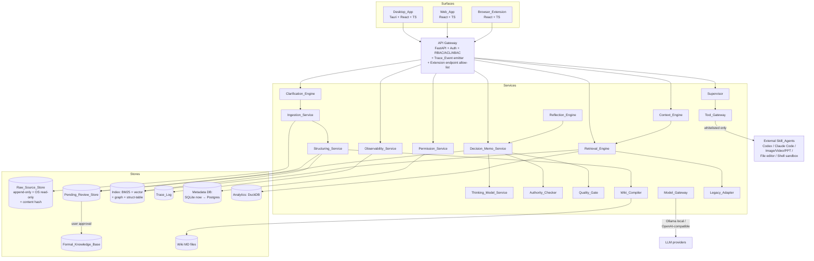

# Design Document — Unified Reality OS

> Authoritative requirements: `./requirements.md` (Req 1–5 detailed per user decisions; Req 6–15 kept as baseline).
> This document describes how Reality_OS will be built. Terminology strictly follows the Glossary in `requirements.md`.

---

## 1. Overview

### 1.1 Product positioning

Reality_OS is the merge of two projects into one single-user reality-augmentation system:

- **KnowDo** (local-first Knowledge Delegation Agent, at `d:\UserData\Desktop\KnowDo`): knowledge lifecycle (Capture → Ingest → Structure → Store → Context Engineer → Retrieve → Quality Gate → Learn → Use → Feedback) with V2 control systems (Context Engine, Quality Gate, Permissions, Observability, Authority Check, Compression/Decompression, Source Priority, Coverage Matrix, Subagent Context Isolation).
- **reality-os** (at `d:\UserData\Desktop\reality-os`, itself the merge of `sou` + `prompt-agent` + `work`): the clarify → retrieve → decide → verify → supervise → reflect pipeline, with Desktop / Web / Extension surfaces.

Reality_OS is **not a chatbot**. It helps a single primary user:

1. Capture real-world inputs (text, file, URL, clipboard, screenshot, image, audio) with immutable raw sources.
2. Turn ambiguous problems into structured clarification objects before any retrieval runs.
3. Retrieve past findings through hybrid, permission- and priority-aware search.
4. Apply top-tier thinking models and emit a Decision_Memo with Quality_Score and Coverage_Matrix snapshots.
5. Verify claims layer-by-layer (claim → evidence → authority → user approval) before knowledge enters the Formal_Knowledge_Base.
6. Delegate skill execution (Codex, Claude Code, image/video/PPT generators, file editors, shell) only through a supervised Tool_Gateway with plan-alignment, destructive-step approval, step audit, and rollback.
7. Reflect after each task and feed learning artifacts back to the user.

Design intent (load-bearing constraints from requirements.md):

- **Assist, do not replace.** The user remains the final decision-maker.
- **Verification strictness.** Model confidence is insufficient evidence — correctness is approached through layered verification, not asserted.
- **Supervised execution.** No Skill_Agent acts outside Tool_Gateway + Execution_Plan + Supervisor.
- **Raw source is immutable.** All derived artifacts are regenerable; unverified claims never enter the Formal_Knowledge_Base.
- **V1 skeleton + V2 control systems preserved.** KnowDo's layers survive the merge.
- **Merge, don't fork.** One identity per user, one Permission_Policy store, one Trace_Event stream, one knowledge graph, three surfaces.

### 1.2 Core loop

```mermaid
flowchart LR
  A[Reality_Input<br/>text/file/URL/<br/>clipboard/screenshot/<br/>image/audio] --> B[Clarification_Engine<br/>goal + success_criteria +<br/>constraints + known_facts +<br/>unknowns + questions]
  B --> C[Retrieval_Engine<br/>BM25 + vector + graph +<br/>struct-table + metadata<br/>+ perm + priority]
  C --> D[Context_Engine<br/>7-stage pipeline<br/>+ Coverage_Matrix<br/>+ compression]
  D --> E[Thinking_Model_Library<br/>auto-match + user-confirm]
  E --> F[Decision_Memo<br/>+ Quality_Score snapshot<br/>+ Coverage_Matrix snapshot]
  F --> G[Claim + Evidence<br/>+ Authority_Checker]
  G -->|supported| H[Supervisor + Tool_Gateway<br/>plan → step → approve →<br/>audit → rollback]
  G -->|disputed/outdated/<br/>unknown| RQ[User Review Queue]
  H --> I[Pending_Review_Store]
  RQ --> I
  I -->|user approval| J[Formal_Knowledge_Base<br/>+ Wiki recompile]
  J --> K[Reflection_Engine<br/>flashcards / quiz / mastery]
  K -.feedback.-> A
  F -.low Quality_Score.-> D
  F -.low Quality_Score.-> C
```



### 1.3 Success criteria (tracked in Req 15)

Verification-pass rate, user-adoption rate, Trace_Event completeness, Quality_Gate coverage, rollback-success rate — each exposed in the observability dashboard and emitted as `metric_regression` Trace_Events when thresholds breach.

---

## 2. High-Level Architecture

### 2.1 Context diagram



### 2.2 Service inventory (KnowDo packages × reality-os services merged)

| Reality_OS service       | KnowDo origin                    | reality-os origin                 | Role                                                                                            |
| ------------------------ | -------------------------------- | --------------------------------- | ----------------------------------------------------------------------------------------------- |
| Clarification_Engine     | (new)                            | `services/prompt-orchestrator`    | Multimodal intake → structured clarification object w/ previous_id chain (Req 2)                |
| Ingestion_Service        | `packages/ingestion`             | `services/knowledge` (intake)     | Parse (MarkItDown/Docling), OCR, ASR, captioning                                                |
| Structuring_Service      | `packages/structuring`           | `services/knowledge` (extract)    | LangExtract + Pydantic → KnowledgeObject / Claim / Evidence                                     |
| Wiki_Compiler            | `packages/wiki`                  | (new; legacy/prompt-agent wiki)   | Async batch recompile; citations / backlinks / versions / conflicts                             |
| Retrieval_Engine         | `packages/retrieval`             | `services/retrieval`              | BM25 + vector + graph + struct-table + metadata; per-retriever permission + priority filters    |
| Context_Engine           | `packages/context_engine`        | (new)                             | 7-stage pipeline, Coverage_Matrix, compression/decompression, budget drop policy                |
| Thinking_Model_Service   | (new)                            | (new)                             | Library CRUD + when_to_use match (≥2 sub-question trigger) + user-confirm gate                  |
| Decision_Memo_Service    | (new)                            | `services/decision`               | Memo generation, versioning, QS/CM snapshots, display_mode per memo                             |
| Quality_Gate             | `packages/quality`               | `services/verification` (gate)    | 10-dim Quality_Score; 5-band policy (≥90/80–89/60–79/40–59/<40)                                 |
| Authority_Checker        | `packages/authority_check`       | `services/verification` (author.) | Trusted-source comparison; never silently rewrite Formal_KB                                     |
| Supervisor               | (new)                            | `services/supervisor`             | Plan-execution alignment, destructive-step approval, violation intercept, rollback, irreversible|
| Tool_Gateway             | (new)                            | `services/tool-gateway`           | Single egress to external Skill_Agents; whitelist + capability + rate-limit + audit             |
| Reflection_Engine        | `packages/learning`, `feedback`  | `services/reflection`, `evals`    | Retrospective + flashcards + quizzes + mastery + mistake log                                    |
| Permission_Service       | `packages/permissions`           | (new)                             | RBAC + ACL + ABAC; enforced at every stage                                                      |
| Observability_Service    | `packages/observability`         | (trace pages)                     | Trace_Event emit, storage, replay, redaction                                                    |
| Model_Gateway            | `packages/model_gateway`         | (new)                             | Ollama local + OpenAI-compatible; tokenizer declaration (Req 4.10)                              |
| Legacy_Adapter           | (new)                            | `legacy/*` read-only              | Expose legacy SQLite/Markdown/JSONL/YAML as read-only sources; Dual_Run_Mode diff               |

### 2.3 Data stores

| Store                  | Technology (v1)           | Target                           | Key property                                                         |
| ---------------------- | ------------------------- | -------------------------------- | -------------------------------------------------------------------- |
| Raw_Source_Store       | Local filesystem, OS RO   | Same + periodic integrity scan   | Append-only by content hash; never overwritten                       |
| Metadata DB            | SQLite                    | Postgres                         | SourceRecord, Permission_Policy, user, session                       |
| Index                  | BM25 (Tantivy/Whoosh)     | + Qdrant / LanceDB               | Per-retriever permission + priority filter built into retrieval plan |
| Graph Store            | (in-memory / SQLite FKs)  | Kuzu / Neo4j                     | Concept / Claim / Evidence edges                                     |
| Analytics              | DuckDB                    | DuckDB                           | Structured-table queries                                             |
| Wiki                   | Markdown files            | Markdown files + git             | Compiled from KOs; versioned; conflict-marked                        |
| Pending_Review_Store   | SQLite table              | Postgres table                   | Every accepted recommendation/claim lands here first                 |
| Formal_Knowledge_Base  | SQLite + files            | Postgres + files                 | Requires explicit user approval Trace_Event to admit                 |
| Trace_Log              | JSONL append-only         | JSONL + Langfuse/Phoenix adapter | Redacted at write time                                               |

---

## 3. Core Data Models

All models are Pydantic classes. Primary keys are ULIDs unless noted. "Immutable" means never updated after creation; new state is represented by a new version with a `previous_id` pointer.

### 3.1 SourceRecord (immutable shell, mutable last_capture metadata)

```
SourceRecord {
  id: ULID                        # PK
  content_hash: SHA256            # dedupe key (Req 3 AC2)
  modality: enum{text,file,url,clipboard,screenshot,image,audio}
  raw_pointer: Path               # path in Raw_Source_Store
  byte_size: int
  created_at: datetime            # immutable
  captured_by: user_id            # immutable
  last_captured_at: datetime      # MUTABLE (reuse on duplicate capture, Req 3 AC2)
  last_captured_by_history: [user_id, ts][]  # append-only
  permission_policy_id: ULID      # FK
  overall_status: enum{ok,degraded}  # Req 2 AC6 — degraded if any derived artifact failed
}
```

### 3.2 DerivedArtifact

```
DerivedArtifact {
  id: ULID
  source_record_id: ULID          # FK → SourceRecord
  type: enum{transcript,extracted_text,visual_description,parsed_document}
  status: enum{ok,failed}
  failure_reason: string?         # machine-readable (Req 2 AC6)
  produced_at: datetime
  producer: string                # model/tool id
  payload_pointer: Path
}
```

### 3.3 ClarificationObject (versioned via previous_id chain)

```
ClarificationObject {
  id: ULID
  source_record_id: ULID
  previous_id: ULID?              # chain (Req 2 AC10)
  goal: string | "unknown"
  success_criteria: [string] | "unknown"
  constraints: [string] | "unknown"
  known_facts: [string] | "unknown"
  unknowns: [string] | "none_detected"   # Req 2 AC7 explicit marker
  proposed_clarifying_questions: [string]
  under_specified: bool
  proceeded_without_clarification: bool   # Req 2 AC9 — but NO priority penalty attached
  created_at: datetime
}
```

### 3.4 ParsedDocument / KnowledgeObject / Claim / Evidence

```
ParsedDocument { id, source_record_id, chunks[], created_at }
Chunk          { id, parsed_document_id, text, start_span, end_span, metadata }
KnowledgeObject{ id, source_record_id, title, body, chunk_ids[], permission_policy_id }
Claim {
  id, knowledge_object_id, text,
  evidence_ids[],                  # 0..N (Req 6 AC2)
  authority_label: enum{supported,disputed,outdated,unknown},
  status: enum{pending,user-approved,user-rejected},
  original_text_snapshot: string,  # Req 6 AC7 — never overwritten
  original_evidence_snapshot: [evidence_id],
  created_at
}
Evidence       { id, claim_id, source_record_id, chunk_id, original_span, relation: enum{supports,contradicts,qualifies} }
```

### 3.5 ContextPack + RetrievalResult + Coverage_Matrix + Quality_Score

```
ContextPack {
  id,
  request_id,
  included_sources: [source_id],
  excluded_sources: [{source_id, reason∈{permission_denied,priority_ignore,budget_drop,dedup,quality_filter}}],
  effective_token_budget: int,
  used_tokens: int,
  tokenizer: string,              # from Model_Gateway, fallback cl100k_base
  compressed_items: [CompressedItem],
  created_at
}

CompressedItem { source_id, chunk_id, original_span, compression_level, compression_method, created_at, model_used, confidence_score }

RetrievalResult{ query, candidates: [Candidate], reranked: [Candidate], filters_applied }
Candidate      { source_id, chunk_id, original_span, score, retriever: enum{bm25,vector,graph,struct,metadata} }

Coverage_Matrix{
  id, request_id, complex_flag: bool,
  dimensions: [{ name, retrieved_sources[], coverage_score: float[0,1], evidence_quality: float[0,1], missing_evidence[], authority_conflicts[], recommendation }]
}

Quality_Score  { id, total: int[0,100], dimensions: { goal_fit, evidence_coverage, source_authority, citation_grounding, conflict_risk, recency_fit, retrieval_sufficiency, user_priority_match, answer_completeness, permission_safety } }
```

### 3.6 Decision_Memo + memo_version (versioned with parent_version)

```
Decision_Memo {
  memo_id: ULID                   # stable across versions
  current_version_id: ULID
  display_mode: enum{recommendation_only, recommendation_with_reasons}  # per-memo (Req 5 AC6)
}

MemoVersion {                     # immutable snapshot
  version_id: ULID
  memo_id: ULID
  parent_version_id: ULID?
  goal, options_considered[≥1 with justification if 1],
  thinking_models_applied: [model_id + matched_condition],
  claims[], evidence_citations[(source_id, chunk_id, span)],
  risks[], unknowns[],
  recommendation, confidence: int[0,100],
  proposed_next_actions: [≥1],
  quality_score_snapshot: Quality_Score,   # immutable (Req 5 AC8)
  coverage_matrix_snapshot: Coverage_Matrix,
  editor, created_at,
  publication_state: enum{no-model-confirmed-provisional, provisional-verification-pending, published-with-uncertainty, published}
}
```

### 3.7 Thinking_Model_Entry

```
ThinkingModelEntry {
  id, name,
  when_to_use: MachineEvaluableCondition,   # e.g., JSON-logic or predicate DSL
  required_inputs[], produced_outputs[],
  worked_examples[≥1],
  citations: [source_id]
}
```

### 3.8 Execution_Plan + Step_Audit_Record (Supervisor + Tool_Gateway)

```
Execution_Plan {
  id, memo_version_id,
  steps: [PlanStep],
  approval_state: enum{draft, awaiting-approval, approved, aborted, completed},
  created_at
}
PlanStep {
  index, tool_id, intended_inputs, expected_outputs, affected_resources,
  is_destructive: bool,                # triggers user approval (Req 7 AC3)
  tolerance: DriftTolerance            # for Supervisor comparison
}
Step_Audit_Record {                    # append-only
  id, plan_id, step_index,
  actual_tool_id, actual_inputs_hash, actual_outputs_hash,
  permission_result, user_approval_status,
  rollback_pointer,                    # how to revert
  status: enum{executed, blocked, aborted, irreversible},
  violation_reason?,                   # if blocked
  timestamp
}
```

### 3.9 Trace_Event

```
TraceEvent {                           # append-only, redacted
  trace_id, task_id, user_id, agent_name, step_name,
  input_summary, output_summary,
  tool_calls[], retrieval_queries[], sources_used[],
  quality_score?, permission_checked: bool,
  tokens, latency_ms, cost, errors?,
  surface: enum{desktop,web,extension,server},
  created_at
}
```

### 3.10 Permission_Policy

```
Permission_Policy {
  id,
  rbac: { role_grants: [(role, capability)] },
  acl: { principal_grants: [(user_id|group_id, capability)] },
  abac: { attribute_rules: [Predicate] },
  owner, created_at, updated_at
}
```

---

## 4. End-to-End Flows

### 4.1 Main loop sequence

```mermaid
sequenceDiagram
  participant U as User
  participant S as Surface (DT/WB/EX)
  participant GW as API Gateway
  participant CLR as Clarification_Engine
  participant ING as Ingestion
  participant STR as Structuring
  participant CTX as Context_Engine
  participant RET as Retrieval_Engine
  participant TML as Thinking_Model_Service
  participant DEC as Decision_Memo
  participant QG as Quality_Gate
  participant AUT as Authority_Checker
  participant SUP as Supervisor
  participant TG as Tool_Gateway
  participant PRE as Pending_Review_Store
  participant FKB as Formal_Knowledge_Base
  participant REF as Reflection_Engine
  participant OBS as Observability

  U->>S: Reality_Input
  S->>GW: POST /v1/capture (surface, payload)
  GW->>ING: persist raw bytes (OS RO + hash)
  GW->>CLR: emit ClarificationObject (blocks retrieval)
  CLR-->>U: clarifying questions (if under-specified)
  U->>CLR: answer → new version via previous_id
  GW->>STR: derive ParsedDocument / KO / Claims / Evidence
  GW->>CTX: compile ContextPack (7 stages)
  CTX->>RET: RetrievalPlanner → parallel retrievers (perm+priority built in)
  CTX->>CTX: CoverageMatrix if complex_flag
  CTX->>CTX: budget drop (Critical upgrades compression first)
  GW->>TML: auto-match when_to_use → user confirms
  GW->>DEC: emit Decision_Memo (fill all required fields)
  DEC->>QG: Quality_Score
  DEC->>AUT: Claim authority labels
  QG-->>DEC: band → publish policy (<60 provisional / 60–89 notice / ≥90 ok)
  AUT-->>DEC: disputed/outdated → user review queue
  DEC-->>S: render per display_mode
  U->>S: accept recommendation
  S->>PRE: write full memo snapshot
  U->>PRE: approve claim
  PRE->>FKB: promote (with Trace_Event)
  alt execution requested
    DEC->>SUP: Execution_Plan
    SUP->>U: destructive step approval
    SUP->>TG: run step
    TG->>Ext: external Skill_Agent (whitelisted)
    TG->>OBS: Step_Audit_Record
    U->>SUP: rollback?
    SUP->>TG: revert using rollback_pointer
  end
  GW->>REF: retrospective + learning artifacts
  note over OBS: TraceEvent emitted at every arrow; redacted at write
```

### 4.2 Permission + Trace injection points

Permission is checked at: capture, ingestion write, index insert, retrieval (per-retriever), context compile, citation emit, memo publish, tool gateway call, export, deletion. Any bypass attempt produces a `permission_bypass_attempt` Trace_Event (Req 12 AC6).

Trace_Event is emitted at: capture accepted, raw persist, each derived artifact (ok/failed), clarification emit, clarification update, retrieval, context pack finalize, memo generate, memo publish, quality gate decision, authority label, review queue move, approval/rejection, plan create, plan approve, each step execute/block, rollback attempt/result, reflection emit, metric_regression.

---

## 5. Component Design

### 5.1 Clarification_Engine

- **Input**: `Reality_Input` + SourceRecord id.
- **Output**: `ClarificationObject` (6 required fields + `unknowns = "none_detected"` if empty).
- **Invariant**: no retrieval, no URL fetch, no OCR/ASR/captioning runs for this Reality_Input before the first ClarificationObject is committed (Req 2 AC8).
- **Versioning**: each user answer creates a new ClarificationObject with `previous_id` pointing to the prior one (Req 2 AC10). The chain is fully reconstructible.
- **Bypass path**: if the object is under-specified and the user chooses "proceed anyway", retrieval is allowed, no flag or priority penalty is attached (Req 2 AC9). `proceeded_without_clarification = true` is stored for audit only.

### 5.2 Retrieval_Engine

- **Plan**: permission filter + Source_Priority filter are **pushed down into each retriever** (Req 3 AC8). Outer engine only merges and reranks.
- **Retrievers**: BM25, vector, graph, structured-table, metadata. All run in parallel on the filtered candidate space.
- **Rerank**: Source_Priority applied as tiered sort key (Critical → High → Normal → Low); within tier, sort by relevance. No weighted multiplier that could inject non-relevant items (Req 4 AC6).
- **Privacy**: no permission-excluded source appears in results, snippets, highlights, facets, aggregate counts, or error messages (Req 3 AC9).
- **Ignore tier**: hard-exclude on default path; `include_ignored=true` caller flag opts in (Req 3 AC10).

### 5.3 Context_Engine

Seven stages, each at most once per request (Req 4 AC1):

1. Goal_Decomposer → `complex_flag = (sub_question_count ≥ 2)`.
2. FirstPrinciplesAnalyzer → dimension list.
3. SourcePrioritySelector → hard-exclude Ignore.
4. CoverageMatrixBuilder → only when complex_flag (Req 4 AC3–4).
5. ContextBudgeter → `budget = model_window − system_prompt_tokens − goal_plan_tokens`; tokenizer from Model_Gateway, fallback `cl100k_base` (Req 4 AC9–10).
6. RetrievalPlanner → calls Retrieval_Engine.
7. ContextPackCompiler → compress, dedupe, budget-drop.

**Budget-drop order** (Req 4 AC12): `(priority_rank ASC, coverage_contribution ASC, source_id ASC)`, one drop record per item.

**Critical-tier safeguard** (Req 4 AC13): before dropping a Critical-tier item, attempt a higher compression_level; only drop if even the most-compressed form still exceeds budget. Every compression-upgrade attempt is traced.

### 5.4 Quality_Gate

Ten-dimension Quality_Score with band policy:

| Total      | Action                                                                                                        |
| ---------- | ------------------------------------------------------------------------------------------------------------- |
| ≥ 90       | Publish normally.                                                                                             |
| 80–89      | Publish with uncertainty note.                                                                                |
| 60–79      | Trigger recovery: expand retrieval OR decompress compressed items; record attempted recovery in Trace_Event.  |
| 40–59      | Route to subagent review (goal analyst / evidence verifier / authority checker).                              |
| < 40       | Do not produce a strong conclusion; report insufficiency + missing-evidence list.                             |

Memo-specific thresholds (Req 5 AC9–11):
- `total < 60` OR `evidence_coverage < 60` OR any required Coverage_Matrix dimension `< 60` → memo marked `provisional-verification-pending`.
- `60–89` → `published-with-uncertainty`.
- `≥ 90` → `published`.

### 5.5 Authority_Checker

- Compares each extracted Claim against a configurable set of designated trusted sources.
- Labels: `supported | disputed | outdated | unknown`.
- **Never** silently rewrites Formal_Knowledge_Base; disputed/outdated Claims route to the review queue with original Claim text and original Evidence spans preserved (Req 6 AC4, AC7).

### 5.6 Tool_Gateway + Supervisor

- Tool_Gateway is the **only** outbound channel to external Skill_Agents (Req 9 AC1). Direct calls from other components are forbidden at the code-review and runtime-policy level.
- Whitelist = `{agent_id → {allowed_capabilities, rate_limit}}`.
- Every call: permission check against the caller's Permission_Policy → forward → record Step_Audit_Record (inputs_hash, outputs_hash, cost, permission result).
- **Supervisor loop**:
  1. Generate Execution_Plan from Decision_Memo.
  2. If any step is destructive → user approval required (Req 7 AC3).
  3. At runtime, compare actual step vs. plan step within `DriftTolerance`; block divergent steps (Req 7 AC2).
  4. Append Step_Audit_Record (Req 7 AC4).
  5. On rollback request, use `rollback_pointer`; if irreversible, mark step `irreversible`, surface to user, never fabricate success (Req 7 AC7).
  6. Any violation of whitelist/permission/policy → abort + Trace_Event + user-visible notification (Req 7 AC5).
- Pause / resume / cancel supported at step boundaries (Req 7 AC8).

### 5.7 Reflection_Engine

- On task conclusion: retrospective (what worked, what failed, unresolved unknowns, updated mental models, candidate knowledge updates).
- Generates flashcards, quiz items, Socratic prompts from Formal_Knowledge_Base content only.
- Tracks mastery per topic; when mastery < threshold AND user is in learning mode → Socratic prompting > direct answer.
- Mistake log links corrections to original memo + trace and surfaces during related future tasks.

### 5.8 Legacy_Adapter + Dual_Run_Mode

- Read-only adapters expose `legacy/sou`, `legacy/prompt-agent`, `legacy/work`, `legacy/study` artifacts (SQLite, Markdown, JSONL, YAML) to Retrieval_Engine.
- No write, rename, or delete under `legacy/` (Req 13 AC2).
- Dual_Run_Mode per-request: executes legacy and unified paths, presents unified as primary, attaches diff summary to Trace_Event (Req 13 AC3).
- Feature flags per capability to disable a legacy adapter once unified replacement passes tests (Req 13 AC4).

---

## 6. Correctness Properties & PBT Strategy

### 6.1 Property families

Derived from Req 14 (round-trip) and extended:

| Family           | Example property                                                                                                   |
| ---------------- | ------------------------------------------------------------------------------------------------------------------ |
| Invariants       | Permission-enforced retrieval never returns a source the caller cannot read.                                       |
|                  | Raw_Source_Store is append-only: for all t1 < t2, bytes(t1) == bytes(t2) or integrity error emitted.               |
|                  | No Claim with `status != user-approved` appears in Formal_Knowledge_Base.                                          |
|                  | A memo with `publication_state = provisional-verification-pending` never emits a strong conclusion downstream.     |
| Round-trip       | `parse(print(memo_version)) ≡ memo_version` over AC-4 fields + QS/CM snapshots.                                    |
|                  | `parse(print(wiki_page))` reaches a fixed point in two iterations.                                                 |
|                  | `deserialize(serialize(trace_event)) ≡ trace_event`.                                                               |
| Idempotence     | Re-ingesting same content_hash produces no duplicate SourceRecord.                                                 |
|                  | Re-approving an already-approved Claim is a no-op.                                                                 |
|                  | Replaying an Execution_Plan at the same step boundary is a no-op.                                                  |
| Metamorphic     | Adding a strictly-lower-priority source never removes a higher-priority source from ContextPack.                   |
|                  | Tightening permissions never enlarges the retrieval result set.                                                    |
|                  | Raising Source_Priority never demotes a result within its tier in rerank.                                          |
| Model-based     | Supervisor's plan-execution comparator rejects every divergent step when measured against a reference interpreter. |
| Confluence      | Order of independent Claim approvals does not change the final Formal_Knowledge_Base state.                        |
| Error           | Invalid serialized memo/wiki/trace payloads raise descriptive errors, not partial objects.                         |
|                  | Tool whitelist violation aborts with auditable reason and no side effects.                                         |

### 6.2 AC → test-type mapping (sample)

| AC                                        | Test type     |
| ----------------------------------------- | ------------- |
| Req 2 AC3 (OS read-only + hash + scan)    | property      |
| Req 3 AC2 (content_hash dedupe)           | property (idempotence) |
| Req 3 AC9 (no-leak)                       | property (metamorphic) |
| Req 4 AC6 (tiered sort key)               | property      |
| Req 4 AC12 (budget-drop order)            | property (model-based) |
| Req 5 AC15 (memo round-trip)              | property (round-trip)  |
| Req 6 AC5 (approval moves to Formal_KB)   | property (confluence)  |
| Req 7 AC2 (supervisor plan alignment)     | property (model-based) |
| Req 7 AC6 (rollback verify)               | example + property |
| Req 12 AC3 (raw append-only)              | property (invariant) |
| Req 13 AC3 (dual-run diff)                | example       |
| Req 15 AC1–5 (metrics)                    | example       |

Full mapping is maintained alongside tests under `tests/properties/`.

### 6.3 Harness

- Python: `hypothesis` for PBT over Pydantic models (strategies built per model); custom shrinking for memo versions.
- Reference interpreter for Supervisor written as a pure function in `services/supervisor/reference.py` used for model-based tests.
- Adversarial fuzz corpus for the parsers (decision memo, wiki, trace event) stored under `tests/fixtures/fuzz/`.

---

## 7. Observability & Trace

### 7.1 Trace_Event schema

See §3.9. Append-only JSONL in V1; Langfuse/Phoenix adapter in V2.

### 7.2 Trace viewer

Web/Desktop page with:
- Filter by `task_id`, `step_name`, `surface`, `user_id`, time range.
- Drill into any Step_Audit_Record.
- Replay: reproduce retrieval + ContextPack decisions from stored events; mark any step whose inputs can no longer be reconstructed (Req 11 AC4).

### 7.3 Redaction

- Secret-pattern scanner runs at write time (API keys, tokens, common secret envs).
- Candidate values are replaced with `[REDACTED:kind]` markers; original never persisted.
- Same redaction applied to logs, model context snapshots, exports (Req 12 AC7).

---

## 8. Security & Permissions

### 8.1 Model

RBAC (roles: Owner / Admin / Editor / Reader / Viewer / No Access) + ACL (per-resource grants) + ABAC (surface, time, location predicates). Evaluated at capture, ingest, index, retrieve, context compile, citation, memo publish, tool invocation, export, delete.

### 8.2 Surface-specific constraints

- **Browser_Extension**: backend returns `403` for anything outside `{capture, clarification, quick-ask, approval}` regardless of token validity (Req 1 AC11). UI restriction is defense-in-depth, not the primary enforcement.
- **Desktop_App**: full admin UI allowed.
- **Web_App**: admin UI allowed when the user's session carries `surface=web` and role permits.

### 8.3 Sandbox

All shell/file/code operations through Tool_Gateway run inside a sandbox with an explicitly-granted filesystem allowlist (Req 12 AC5). Cloud Skill_Agents (Codex, Claude Code) are called over network with rate-limited, capability-scoped credentials stored in the OS keychain.

### 8.4 Raw_Source_Store integrity

- Write: compute `content_hash`, flip file to OS read-only, record path + hash.
- Read: verify bytes against hash; mismatch → `integrity_error` Trace_Event + surface to user.
- Scheduler: periodic integrity scan across the store (Req 2 AC3).

### 8.5 Identity

Three surfaces authenticate independently; token format is shared; validation hits the same backend token service (Req 1 AC2–3). No time-based expiration; logout or server-side revocation is the only way a token becomes invalid (Req 1 AC4–5). Application-level lockout on failed attempts is delegated to the underlying identity provider (Req 1 AC12); failures still emit Trace_Events.

---

## 9. Migration Strategy

### 9.1 Directory merge plan

| Target (Reality_OS)                      | From KnowDo                        | From reality-os                          |
| ---------------------------------------- | ---------------------------------- | ---------------------------------------- |
| `apps/api/`                              | `apps/api/`                        | `apps/api/`                              |
| `apps/desktop/`                          | `apps/desktop/`                    | `apps/desktop/`                          |
| `apps/web/`                              | —                                  | `apps/web/`                              |
| `apps/extension/`                        | —                                  | `apps/extension/`                        |
| `services/clarification/`                | (new)                              | `services/prompt-orchestrator/`          |
| `services/retrieval/`                    | `packages/retrieval/`              | `services/retrieval/`                    |
| `services/context_engine/`               | `packages/context_engine/`         | (new)                                    |
| `services/quality/`                      | `packages/quality/`                | `services/verification/` (quality path)  |
| `services/authority/`                    | `packages/authority_check/`        | `services/verification/` (author. path)  |
| `services/supervisor/`                   | (new)                              | `services/supervisor/`                   |
| `services/tool_gateway/`                 | (new)                              | `services/tool-gateway/`                 |
| `services/decision_memo/`                | (new)                              | `services/decision/`                     |
| `services/reflection/`                   | `packages/learning/`, `feedback/`  | `services/reflection/`, `evals/`         |
| `services/ingestion/`                    | `packages/ingestion/`              | `services/knowledge/` (intake)           |
| `services/structuring/`                  | `packages/structuring/`            | `services/knowledge/` (extract)          |
| `services/wiki/`                         | `packages/wiki/`                   | `legacy/prompt-agent/wiki`               |
| `services/permissions/`                  | `packages/permissions/`            | (new)                                    |
| `services/observability/`                | `packages/observability/`          | (trace pages)                            |
| `services/model_gateway/`                | `packages/model_gateway/`          | (new)                                    |
| `services/legacy_adapter/`               | (new)                              | `legacy/*` read-only                     |
| `packages/core/` (shared schemas)        | `packages/core/`                   | `packages/types/`, `packages/schemas/`   |

### 9.2 Coexistence rules

- `legacy/*` is never modified, renamed, or deleted by adapter operations (Req 13 AC2).
- Each capability has a feature flag: `legacy_only | unified_only | dual_run`.
- Default during migration: `dual_run` for high-risk capabilities (retrieval, memo generation), `unified_only` for new capabilities (supervisor, tool_gateway).
- Dual_Run_Mode diff is attached to Trace_Event; diffs beyond a threshold are surfaced to the user before promotion to `unified_only`.

### 9.3 Storage migration

- V1: SQLite + local filesystem + JSONL traces.
- V2: SQLite → Postgres via one-shot export/import; JSONL traces → Langfuse/Phoenix adapter.
- Wiki stays as Markdown files (+ git) throughout.

---

## 10. Open Issues & Risks

1. **Critical-tier compression upgrade (Req 4 AC13)** — the highest compression level may still distort semantic content; need a fidelity test to decide when to force a user prompt instead of auto-compressing.
2. **Authority_Checker trusted-source curation** — requires a first-class UI to maintain the trusted-source list and its weights; v1 ships with a config file.
3. **Dual_Run_Mode cost** — every dual-run request roughly doubles LLM spend; a sampling policy is needed before production enabling.
4. **Browser_Extension capture modalities** — video/audio capture from the extension depends on browser capabilities and permissions; image + selection capture is v1, audio is v2.
5. **Rollback semantics for external Skill_Agents** — file edits and local PPT generation are reversible; external social messages, purchases, git pushes are irreversible and must be classified destructively up front.
6. **Tokenizer mismatches** — if the Model_Gateway declares a tokenizer but the actual model uses another (adapter or proxy), the budget estimate drifts; mitigate by reconciling with provider-reported token counts and emitting a drift warning.
7. **Learning mode vs. direct-answer mode** — when mastery is low AND the user is under time pressure, the "Socratic > direct answer" rule frustrates. Needs a user-level override per session.
8. **Legacy SQLite schema drift** — `legacy/sou` and `legacy/work` may have schema updates post-fork; adapters should version-guard.
9. **Extension offline queue** — browser extensions have tighter storage quotas than Desktop; the 500-item queue cap (Req 1 AC9–10) may need a lower per-surface override.
10. **Thinking_Model_Library governance** — who can add/modify entries, and how `when_to_use` conditions are reviewed for correctness, is deferred to a later admin workflow.

---

*End of design.md*
