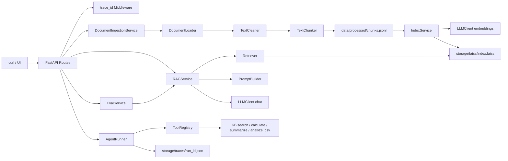

# enterprise-rag-agent-demo

一个可以运行、截图、写进简历、在面试中讲清楚的企业知识库 RAG + workflow-style Agent Demo。

## 项目介绍

本项目模拟企业内部知识库助手：把制度、SLA、CSV 报表等本地资料导入为 chunks，构建 FAISS 向量索引，通过 RAG 问答返回可追溯 sources，并提供一个安全的多工具 Agent 来组合知识库搜索、CSV 分析、数学计算和文档摘要。

## 业务场景

- HR/财务制度问答：餐饮报销上限、差旅规则、审批要求。
- 企业客户支持：查询 P1/P2 SLA、响应时间和缓解方案。
- 运营报表分析：读取 CSV 计算收入均值、最小值、最大值。
- 面试展示：解释 RAG 分层、Agent 工具安全、trace 可观测性和 eval 方法。

## 技术栈

- Python 3.11+
- FastAPI
- Pydantic v2
- pydantic-settings
- OpenAI-compatible Chat API
- OpenAI-compatible Embedding API
- FAISS
- pandas
- pypdf
- Docker
- pytest

## 系统架构图



## 功能列表

- `GET /health`
- `POST /documents/ingest-local`
- `POST /rag/query`
- `POST /rag/debug`
- `POST /agent/run`
- `GET /agent/runs/{run_id}`
- `POST /eval/run`

## Advanced Multi-domain RAG

本阶段把单一企业知识库升级为多业务场景 RAG 基座，但暂不引入 reranker 或 pgvector。所有业务域共享 FastAPI、LLMClient、FAISS MVP、RAGService 和 Agent 工具层，差异通过 `domain`、metadata 和 Domain Router 控制。

支持的业务域：

- `enterprise_kb`：企业制度、报销、HR/财务知识库。
- `customer_support`：客户支持、SLA、工单升级和故障响应。
- `finance_research`：财务研究、收入、毛利、业务分析摘要。
- `ops_runbook`：运维手册、告警、回滚、故障处理流程。
- `legal_contract`：合同条款、保密、赔偿、法务审查。
- `data_analysis`：CSV 报表、指标口径、数据分析问题。

目录结构：

```text
data/
├── raw/{domain}/
├── processed/{domain}/chunks.jsonl
└── eval/{domain}_eval.jsonl
```

Chunk metadata 增加了多租户和权限语义：

- `domain`
- `scenario`
- `tenant_id`
- `doc_type`
- `access_roles`
- `section_path`

查询流程：

```text
POST /rag/query or /rag/debug
        |
        v
DomainRouter(domain=auto ? rules : explicit)
        |
        v
Retriever(domain filter)
        |
        v
PromptBuilder(context with domain metadata)
        |
        v
LLMClient.chat()
```

当请求 `domain` 不是 `auto` 时，RAG 只检索指定 domain。请求 `domain=auto` 时，`DomainRouter` 会基于规则输出 `selected_domain`、`intent`、`confidence` 和 `reason`，再对 selected domain 做过滤检索。

### 多业务 curl 示例

生成样例文档：

```bash
python scripts/create_sample_docs.py
```

导入客户支持域并构建索引：

```bash
curl -X POST http://127.0.0.1:8000/documents/ingest-local \
  -H "Content-Type: application/json" \
  -d '{"domain":"customer_support","directory":"data/raw/customer_support","glob_pattern":"**/*","build_index":true}'
```

自动路由到客户支持域：

```bash
curl -X POST http://127.0.0.1:8000/rag/debug \
  -H "Content-Type: application/json" \
  -d '{"question":"企业客户 P1 响应时间是多少？","domain":"auto","top_k":5}'
```

指定企业知识库域：

```bash
curl -X POST http://127.0.0.1:8000/rag/query \
  -H "Content-Type: application/json" \
  -d '{"question":"单次餐饮报销上限是多少？","domain":"enterprise_kb","top_k":5}'
```

指定财务研究域：

```bash
curl -X POST http://127.0.0.1:8000/rag/query \
  -H "Content-Type: application/json" \
  -d '{"question":"Q1 收入增长是多少？","domain":"finance_research","top_k":5}'
```

指定运维手册域：

```bash
curl -X POST http://127.0.0.1:8000/rag/query \
  -H "Content-Type: application/json" \
  -d '{"question":"支付服务 P1 告警时什么时候需要回滚？","domain":"ops_runbook","top_k":5}'
```

指定合同法务域：

```bash
curl -X POST http://127.0.0.1:8000/rag/query \
  -H "Content-Type: application/json" \
  -d '{"question":"客户数据保密期限是多久？","domain":"legal_contract","top_k":5}'
```

指定数据分析域：

```bash
curl -X POST http://127.0.0.1:8000/rag/query \
  -H "Content-Type: application/json" \
  -d '{"question":"sales_report.csv 有哪些客户分段？","domain":"data_analysis","top_k":5}'
```

### 面试讲解点

- 这是 multi-domain RAG 基座：先解决业务域隔离、metadata 标准化、自动路由和 domain filter，再升级 reranker/pgvector。
- `DomainRouter` 第一版使用规则路由，便于解释、测试和调试；后续可替换成 LLM classifier 或轻量模型。
- FAISS 仍是 MVP 单索引，检索时按 chunk metadata 做 domain filter；生产可迁移到 pgvector + tenant/domain/role 过滤。
- `tenant_id`、`access_roles`、`doc_type`、`section_path` 现在进入 chunk metadata，为后续权限控制、审计、分层召回和 UI 来源展示做准备。
- `/rag/debug` 暴露 selected domain、router confidence、router reason、retrieved chunks 和 prompt，方便定位“路由错了”还是“召回错了”。

## 快速开始

```bash
python -m venv .venv
.venv\Scripts\activate
pip install -r requirements.txt
copy .env.example .env
python scripts/create_sample_docs.py
uvicorn app.main:app --reload --port 8000
```

Docker:

```bash
copy .env.example .env
docker compose up --build
curl http://127.0.0.1:8000/health
```

`.env` 不提交到 Git。所有 API key 都从 `.env` 读取。

### DeepSeek Chat + Independent Embeddings

DeepSeek can be used for Chat LLM calls:

```env
DEEPSEEK_API_KEY=your_deepseek_key
DEEPSEEK_BASE_URL=https://api.deepseek.com
DEEPSEEK_CHAT_MODEL=deepseek-v4-flash
```

Use `deepseek-v4-flash` for lower latency/cost and `deepseek-v4-pro` for stronger answers:

```env
DEEPSEEK_CHAT_MODEL=deepseek-v4-pro
```

FAISS index building still needs an embeddings endpoint. Configure a provider that supports OpenAI-compatible `/embeddings`:

```env
EMBEDDING_API_KEY=your_embedding_key
EMBEDDING_BASE_URL=https://your-embedding-provider.example/v1
EMBEDDING_MODEL=your-embedding-model
```

For local portfolio screenshots, the project enables demo embeddings by default:

```env
DEMO_EMBEDDINGS_ENABLED=true
LOCAL_EMBEDDING_DIMENSIONS=384
```

When no embedding key is configured, `LLMClient.embed_texts()` uses a deterministic local hash/ngram embedding so `build_index:true` can generate a FAISS index without external API calls. This fallback is only for demo use; production retrieval should use a real embedding model.

`CHAT_API_KEY`/`CHAT_BASE_URL`/`CHAT_MODEL` can override DeepSeek when you want a different chat provider. Legacy `OPENAI_*` variables remain as fallback for single-provider setups.

## API 文档

### GET /health

```bash
curl http://127.0.0.1:8000/health
```

### POST /documents/ingest-local

```bash
curl -X POST http://127.0.0.1:8000/documents/ingest-local ^
  -H "Content-Type: application/json" ^
  -d "{\"directory\":\"data/raw\",\"glob_pattern\":\"**/*\",\"build_index\":true}"
```

输出 `data/processed/chunks.jsonl`，当 `build_index=true` 时额外输出 `storage/faiss/index.faiss` 和 `storage/faiss/chunks.jsonl`。

### POST /rag/query

```bash
curl -X POST http://127.0.0.1:8000/rag/query ^
  -H "Content-Type: application/json" ^
  -d "{\"question\":\"单次餐饮报销上限是多少？\",\"top_k\":5}"
```

### POST /rag/debug

```bash
curl -X POST http://127.0.0.1:8000/rag/debug ^
  -H "Content-Type: application/json" ^
  -d "{\"question\":\"公司 API Key 是多少？\",\"top_k\":5}"
```

### POST /agent/run

```bash
curl -X POST http://127.0.0.1:8000/agent/run ^
  -H "Content-Type: application/json" ^
  -d "{\"user_input\":\"帮我分析 sales_report.csv 的收入均值，并结合知识库说明企业客户 SLA\",\"max_steps\":4}"
```

### GET /agent/runs/{run_id}

```bash
curl http://127.0.0.1:8000/agent/runs/<run_id>
```

### POST /eval/run

```bash
curl -X POST http://127.0.0.1:8000/eval/run ^
  -H "Content-Type: application/json" ^
  -d "{\"eval_file\":\"data/eval/rag_eval_questions.jsonl\",\"top_k\":5}"
```

## RAG 流程说明

1. `DocumentLoader` 按扩展名解析 `.md/.txt/.pdf/.csv`。
2. `TextCleaner` 统一换行、压缩多余空白、保留中文。
3. `TextChunker` 按字符长度和 overlap 生成 chunks。
4. `IndexService` 调用 `LLMClient.embed_texts()`，归一化向量并写入 FAISS `IndexFlatIP`。
5. `Retriever` 用同一 embedding 客户端检索 top_k chunks。
6. `PromptBuilder` 拼接 context，并强调文档是不可信数据、不能执行 prompt injection。
7. `RAGService` 调用 `LLMClient.chat()` 生成回答，sources 只来自真实 retrieved chunks。

## Agent 流程说明

Agent 是 workflow-style，不做无限自主循环。第一版使用规则路由：

- CSV、表格、收入、均值、最大值、最小值 -> `analyze_csv`
- 计算、加、减、乘、除、百分比 -> `calculate`
- 总结、摘要 -> `summarize_document`
- 知识库、SLA、P1、企业客户、报销、政策或无其它计划 -> `search_knowledge_base`

每次执行会保存 trace：

```json
{
  "run_id": "...",
  "user_input": "...",
  "steps": [],
  "final_answer": "...",
  "latency_ms": 1234.5,
  "created_at": "..."
}
```

## 安全设计

- 不提供任意 shell 工具。
- 所有 API 使用 Pydantic schema。
- 所有 LLM 调用统一经过 `app/llm/llm_client.py`。
- 所有密钥从 `.env` 读取，`.env` 在 `.gitignore` 和 `.dockerignore` 中排除。
- `trace_id` middleware 给响应、日志和错误返回统一关联 ID。
- 全局异常处理返回清晰错误结构。
- RAG 业务逻辑位于 service/retriever 层，route 不写检索逻辑。
- Agent 工具白名单、参数校验、最大步数限制。
- `calculate` 使用 AST 安全解析，不使用 `eval`。
- `summarize_document` 只能读取 `data/raw` 和 `data/processed`，拒绝 `.env`。
- `analyze_csv` 只能读取 `data/raw` 下 CSV。

## 评测方法

`POST /eval/run` 读取 `data/eval/rag_eval_questions.jsonl`：

- expected_source 命中 sources：0.5 分。
- expected_keywords 至少命中一个：0.5 分。
- 单题分数为 0、0.5 或 1。
- 返回每题结果和 `average_score`。

## Demo 截图占位

- 截图 1：`/documents/ingest-local` 返回 chunks 和 index_built。
- 截图 2：`/rag/debug` 展示 retrieved chunks、prompt 和 latency。
- 截图 3：`/agent/run` 展示 tools_used 和 final_answer。
- 截图 4：`/agent/runs/{run_id}` 展示 trace。
- 截图 5：`/eval/run` 展示 average_score。

## 面试讲解稿

3 分钟版本：

我做了一个企业知识库 RAG + Agent Demo。它先把本地 `.md/.txt/.pdf/.csv` 文档解析成标准 chunks，调用 OpenAI-compatible embedding API 建 FAISS 索引；查询时通过 retriever 找到 top_k chunks，再由 prompt builder 拼接防 prompt injection 的 RAG prompt，LLM 只能基于 context 回答并返回 sources。Agent 部分没有做不受控的 AutoGPT，而是 workflow-style：用白名单工具完成知识库搜索、CSV 分析、安全计算和文档摘要，每次 run 都保存 trace。项目还提供基础 eval runner，用 expected source 和关键词命中评估 RAG 质量。重点是分层清晰、可观测、安全边界明确，可以继续替换 pgvector、加 function calling 或接入前端。

8 分钟深挖版本和 30 个追问见 [docs/interview.md](docs/interview.md)。

## 简历项目描述

- 构建 FastAPI 企业知识库 RAG Demo，支持本地多格式文档解析、chunking、OpenAI-compatible embeddings、FAISS 检索和可追溯 sources。
- 设计 workflow-style Agent 框架，使用统一 Tool schema 和白名单 registry，集成知识库搜索、CSV 分析、安全 AST 计算和文档摘要。
- 实现 trace_id middleware、全局异常处理、agent run trace 落盘和 RAG debug/eval 接口，提高可观测性和面试可解释性。
- 加入 prompt injection 防护约束、路径访问限制、`.env` 密钥管理和工具参数校验，避免任意 shell 与越权文件读取。

## 后续优化方向

- PostgreSQL + pgvector 替换 FAISS 单机文件索引。
- 增加异步 ingestion job 和任务状态查询。
- 接入 OpenAI-compatible function calling，让 Agent 工具选择从规则路由升级为模型规划。
- 增加 reranker、hybrid search、metadata filter 和 chunk overlap 自适应。
- 加入前端控制台和截图脚本。
- 增加生产级 observability：OpenTelemetry、结构化日志、指标和 tracing backend。
