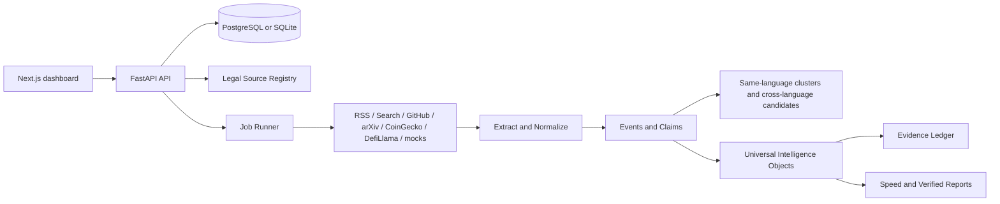

# Intelligence OS

Evidence-first intelligence platform for AI, crypto, technology, AI products, and ecommerce market monitoring.

The system is not a generic news summarizer. It separates two operating modes:

- Speed Mode: fast trend discovery. It answers "what is being discussed" with source counts, velocity, hype/fear/uncertainty signals, and no hard factual conclusion.
- Verified Mode: claim-level verification. It answers "what happened and can we trust it" with evidence URLs, quotes, compliance status, conflicts, and confidence.

## Architecture



## Core Modules

- Legal Source Registry: source metadata, access policy, robots status, retention, attribution, and compliance decisions.
- Collectors: pluggable collectors for RSS, search providers, GitHub, arXiv, market data, Product Hunt, and ecommerce mocks.
- Normalization: canonical URL, content hash, language detection, entity extraction, duplicate flags.
- Evidence Ledger: immutable evidence rows with URL, quote, source, content hash, ledger hash, legal policy, and claim support.
- Cluster Engine: same-language clustering first, then conservative cross-language candidate links.
- Mode Engines: Speed Mode trend objects and Verified Mode evidence-backed objects.
- Index System: credibility, novelty, impact, actionability, urgency, and aggregate score.
- Reports: separate generated reports for speed and verified workflows.
- Dashboard: 14 operational pages covering overview, modes, clusters, evidence, sources, compliance, watchlists, product reviews, crypto, ecommerce, reports, jobs, and settings.

## Local Run

Backend:

```powershell
cd backend
$env:PYTHONPATH='.deps'
.\.venv\Scripts\python.exe -m alembic upgrade head
.\.venv\Scripts\python.exe scripts\seed.py
.\.venv\Scripts\python.exe -m uvicorn app.main:app --host 0.0.0.0 --port 8000
```

Frontend:

```powershell
cd frontend
npm.cmd run dev
```

URLs:

- Frontend: http://localhost:3000
- Backend: http://localhost:8000
- Health: http://localhost:8000/health
- OpenAPI: http://localhost:8000/docs

## Docker Run

```bash
cp .env.example .env
docker compose up --build
```

Docker uses PostgreSQL, Redis, and Qdrant. Local PowerShell defaults to `backend/intel_agent.db` SQLite unless `DATABASE_URL` is set.

## Useful Commands

```powershell
cd backend
$env:PYTHONPATH='.deps'
.\.venv\Scripts\python.exe -m pytest -q
.\.venv\Scripts\python.exe -m ruff check app tests scripts alembic\versions
```

```powershell
cd frontend
npm.cmd run lint
npm.cmd run build
```

## Key API Areas

- `/api/sources`, `/api/source-policies`, `/api/compliance-decisions`
- `/api/intelligence-objects`, `/api/evidence-ledger`
- `/api/events`, `/api/clusters`, `/api/cross-language-candidates`
- `/api/reports`, `/api/jobs`, `/api/watchlists`
- `/api/product-reviews`, `/api/settings`

## Operating Rules

1. Legality has priority over coverage.
2. Speed Mode shows trends, not certainty.
3. Verified Mode outputs only evidence-bound claims.
4. Every conclusion must trace back to source material.
5. Duplicate stories increase trend weight; they are not summarized repeatedly.
6. Cluster same-language material before cross-language matching.
7. Public opinion and facts remain separate.
8. Structured API data has priority over article narration where available.
