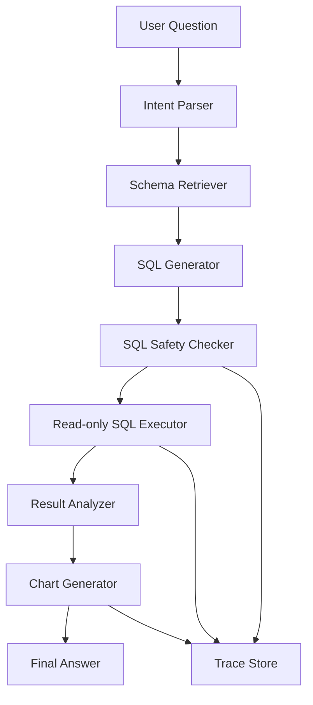

# AI 数据分析 Agent 演示系统

`data-analyst-agent` 是一个面向业务分析场景的 Text-to-SQL Agent。用户用中文提出业务问题，系统先读取 SQLite schema 做 grounding，再生成结构化 SQLPlan，通过 SQL Safety Checker 校验，只执行只读 SELECT，最后返回中文业务结论、SQL、表格、图表、trace、耗时、行数和安全检查结果。

## 为什么做 Data Analyst Agent

很多企业内部分析需求不是“问文档”，而是“问数据”：营收趋势、区域增长、渠道转化、毛利率、工单满意度、投放 ROI。这个项目展示 AI Agent 如何把自然语言问题转成安全、可审计、可复现的数据分析流程。

## 和 RAG 项目的差异

RAG 项目关注知识库检索、文档切片、向量召回和答案引用；本项目不做 RAG，也不做客服工单 workflow。它专注结构化数据库分析：Schema Grounding、Text-to-SQL、SQL 安全校验、只读执行、图表生成和审计日志。

## 技术栈

Python、FastAPI、Pydantic、SQLite、pandas、matplotlib、OpenAI-compatible API、Structured Outputs / JSON Schema 思路、pytest、Docker。

没有真实 LLM key 时，系统会使用 rule-based fallback，保证 demo 可运行。

## 架构图



## 数据表说明

- `orders`：订单收入、成本、区域、渠道、产品线、客户和状态。
- `customers`：客户名称、行业、区域、客户等级和创建时间。
- `tickets`：客服工单类别、优先级、状态、解决时长和满意度。
- `marketing_spend`：市场投放日期、渠道、区域、花费、线索和转化。

初始化脚本会生成模拟业务数据：`orders >= 300`、`customers >= 50`、`tickets >= 100`、`marketing_spend >= 100`。

## Text-to-SQL 流程

1. 用户提交中文业务问题。
2. Intent Parser 先拒绝危险 SQL、本地文件读取和密钥读取。
3. Schema Retriever 返回表、字段、类型、样例值、行数和字段说明。
4. SQL Generator 输出 Pydantic `SQLPlan`，避免自由文本解析。
5. SQL Safety Checker 只允许 SELECT 并强制 LIMIT。
6. Read-only SQL Executor 使用 SQLite 只读连接和 authorizer。
7. Result Analyzer 生成中文业务结论。
8. Chart Generator 输出 PNG 图表。
9. Trace Store 写入 `data/traces/runs.jsonl`。

## Schema Grounding

`GET /data-agent/schema` 返回数据库 schema。查询前，Agent 会先读取 schema，再把 schema 传给 SQL 生成器。fallback 模板只使用已知表和字段，避免模型凭空猜表名或列名。

## SQL Safety Checker

安全策略：

- 只允许 `SELECT`
- 拒绝 `DROP`、`DELETE`、`UPDATE`、`INSERT`、`ALTER`、`CREATE`、`REPLACE`、`ATTACH`、`DETACH`、`PRAGMA`、`VACUUM`、`TRUNCATE`
- 拒绝多语句
- 强制外层 `LIMIT`
- 拒绝访问 SQLite 系统表
- 拒绝读取本地文件、扩展、API key、token、password、secret
- 执行阶段使用 SQLite authorizer，只允许 read/select 和白名单函数
- trace 写入前会做敏感信息 redaction

## 图表生成

默认使用 matplotlib 生成 `bar`、`line`、`pie` 或 `none` 图表，保存到：

```text
data/charts/{run_id}.png
```

如果本地环境缺少 matplotlib，系统会写入降级 PNG，保证查询流程不崩溃。图表失败会返回 `chart_error`，不会影响 SQL 结果和 trace。

## Trace / 审计日志

每次查询保存：

```json
{
  "run_id": "run_xxx",
  "trace_id": "trace_xxx",
  "question": "...",
  "schema_used": ["orders"],
  "sql_plan": {},
  "sql_validation": {},
  "executed_sql": "...",
  "row_count": 10,
  "chart_result": {},
  "final_answer": "...",
  "latency_ms": 123,
  "created_at": "...",
  "finished_at": "..."
}
```

查询接口：`GET /data-agent/runs/{run_id}`。

## 快速启动

```bash
cd data-analyst-agent
python -m venv .venv
.venv\Scripts\activate
pip install -r requirements.txt
python scripts/init_db.py
uvicorn app.main:app --host 0.0.0.0 --port 8780
```

访问：

- Demo 页面：`http://127.0.0.1:8780/demo`
- Swagger：`http://127.0.0.1:8780/docs`
- 健康检查：`http://127.0.0.1:8780/health`

受保护接口默认使用请求头：

```text
x-api-key: change-me
```

## Docker

```bash
cd data-analyst-agent
docker compose up --build
```

端口：`8780`，不会和 RAG 的 `8765`、Workflow Agent 的 `8770` 冲突。

## API 示例

```bash
curl -X POST http://127.0.0.1:8780/data-agent/query ^
  -H "Content-Type: application/json" ^
  -H "x-api-key: change-me" ^
  -d "{\"question\":\"2025 年各季度营收变化趋势是什么？\"}"
```

校验 SQL：

```bash
curl -X POST http://127.0.0.1:8780/data-agent/validate-sql ^
  -H "Content-Type: application/json" ^
  -H "x-api-key: change-me" ^
  -d "{\"sql\":\"SELECT region, SUM(revenue) FROM orders GROUP BY region\"}"
```

## Demo 问题

- 2025 年各季度营收变化趋势是什么？
- 哪个区域营收增长最快？
- 哪个渠道转化率最低？
- 各产品线毛利率排名如何？
- 华东地区哪个产品线收入最高？
- P1 工单平均解决时间是多少？
- 哪类客服问题满意度最低？
- 哪个行业客户贡献收入最高？
- 市场投放 ROI 最高的渠道是什么？
- 上个月新增客户主要来自哪些区域？

## 测试命令

```bash
cd data-analyst-agent
python -m pytest
```

一键验收需要先启动服务：

```bash
python scripts/final_acceptance_check.py
```

验收脚本会检查 `/health`、`/demo`、`/data-agent/schema`、3 个正向分析 case、2 个安全拒绝 case、trace 查询和 chart_url 访问，并禁用 urllib 自动代理。

## 面试讲解稿

这个项目模拟企业 BI/运营分析场景。我没有把它做成文档问答，而是做成一个受控的 Data Analyst Agent：先用 schema grounding 限定表和字段，再让模型或 fallback 输出结构化 SQLPlan，SQL 进入 Safety Checker，只有 SELECT 才能进入只读执行器。执行结果会生成中文业务结论、表格和图表，同时写入 trace，便于审计和复盘。项目重点不是炫耀模型，而是展示 AI 进入真实业务系统时必须具备的安全边界、可解释性和可运维性。

## 简历 bullet points

- 构建 AI Data Analyst Agent，支持中文 Text-to-SQL、Schema Grounding、只读 SQL 执行和业务结论生成。
- 设计 SQL Safety Checker，拦截 DDL/DML、多语句、SQLite 系统表、本地文件和密钥读取，并强制 LIMIT。
- 使用 Pydantic 表达 Structured Outputs，避免自由文本解析，提高 SQL 计划稳定性。
- 实现 matplotlib 图表生成和 JSONL trace 审计日志，支持 run_id 回放分析过程。
- 提供 pytest、Docker、一键验收脚本和无 LLM key 的 rule-based fallback。

## 局限性

- fallback 只覆盖预设业务问题，不等价于通用 SQL 生成器。
- SQLite 适合 demo，不适合直接承载大规模分析负载。
- 当前没有用户级数据权限、指标语义层和成本控制。
- 图表样式偏基础，生产环境应接入前端可交互图表。

## 生产化路线

- 接入指标语义层，统一收入、毛利率、ROI 等口径。
- 引入真实 LLM structured output，并对 SQLPlan 做 schema/AST 二次校验。
- 使用 SQL parser 做更细粒度的列级、表级权限控制。
- 增加查询成本估算、慢查询中断、缓存和分页。
- 接入企业 SSO、RBAC、租户隔离和审计告警。
- 将 SQLite 替换为只读数仓连接，如 PostgreSQL、DuckDB、ClickHouse 或 BigQuery。

