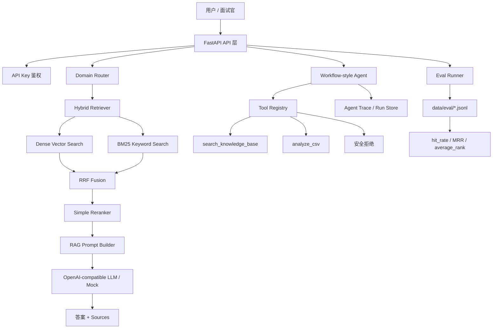

# 企业知识库 RAG 与多工具 Agent 演示系统

这是一个面向 RAG 工程师 / Agent 工程师 / 大模型应用开发岗位的作品集项目。项目模拟企业内部知识库场景，支持多业务域知识检索、混合检索、重排序、工具调用 Agent、CSV 数据分析、检索评测、运行 trace 和中文 Swagger 演示页面。

项目不是简单的 ChatGPT Wrapper，而是一个具备工程分层、可观测性、安全边界和验收脚本的 production-oriented RAG + Agent Demo。

## 项目亮点

- 多业务域 RAG：覆盖企业制度、客户支持、运维手册、法律合同和数据分析场景。
- 混合检索链路：Dense Retrieval + BM25 + RRF / Fusion + Simple Reranker。
- Contextual Retrieval：在 chunk 上保留 contextual_text，提升可解释检索上下文。
- Workflow-style Agent：通过规则和白名单工具完成知识库查询、CSV 分析、安全拒绝和 trace 记录。
- 可验收：提供 pytest、OpenAPI 中文化检查、Eval JSONL 和最终一键验收脚本。
- 可展示：提供 `/demo` 中文演示页、`/docs` Swagger 文档、截图指南和面试讲解材料。

## 适用业务场景

- 企业内部知识库问答：制度、SLA、合同、运维 runbook。
- 客服 / 售后知识检索：按业务域路由，返回 sources 和 debug 信息。
- 运维知识助手：查询故障处理流程和引用来源。
- 合同条款问答：查询责任上限、违约责任等条款。
- 轻量数据分析助手：对受控 CSV 文件做均值、最大值、最小值统计。

## 技术栈

- API：FastAPI、Pydantic、Uvicorn
- RAG：FAISS、本地向量检索、BM25、Hybrid Retrieval、RRF、Simple Reranker、Contextual Retrieval
- Agent：workflow-style tool runner、工具白名单、Pydantic 参数校验、路径白名单、run trace
- Eval：JSONL 测试集、hit_rate、MRR、average_rank、expected_source 命中
- 安全：API Key、tenant_id、access_roles、敏感输出清洗、`.env` 拒绝、shell 删除拒绝
- 可观测性：trace_id、run_id、agent steps、latency、`/agent/runs/{run_id}`
- 部署：Dockerfile、docker-compose，预留 pgvector 扩展方向

## 系统架构



## RAG 流程说明

1. API 接收 `question`、`domain`、`top_k`。
2. 当 `domain=auto` 时，Domain Router 判断问题所属业务域。
3. Hybrid Retriever 同时执行 Dense Retrieval 和 BM25。
4. RRF / Fusion 融合两路候选结果。
5. Simple Reranker 对候选 chunk 二次排序。
6. Prompt Builder 组合 context，生成答案并返回 `sources` 和 `debug`。
7. 每次查询生成 `trace_id`，便于面试中解释检索链路。

## Agent 流程说明

Agent 采用 workflow-style，而不是 AutoGPT 式无限循环。原因是这个 Demo 面向企业知识库场景，关键要求是可控、可验收、可追踪，而不是追求完全自主决策。

当前 Agent 支持：

- `search_knowledge_base`：查询知识库并返回来源。
- `analyze_csv`：分析 `data/raw/data_analysis/sales_report.csv` 的收入均值、最大值、最小值。
- 安全拒绝：拒绝读取 `.env`、拒绝执行 shell 删除命令。
- trace 查询：通过 `GET /agent/runs/{run_id}` 回放工具选择、参数、结果和耗时。

## 多业务域说明

接口 enum 保持英文，便于 API 稳定兼容：

- `auto`
- `enterprise_kb`
- `customer_support`
- `finance_research`
- `ops_runbook`
- `legal_contract`
- `data_analysis`

样例数据位于 `data/raw/`，评测数据位于 `data/eval/`。

## 检索增强能力

- Dense Retrieval：适合语义相似问题，解决同义表达、自然语言问法的问题。
- BM25：适合关键词、编号、错误码、条款名等精确匹配。
- RRF / Fusion：融合 Dense 和 BM25，降低单一检索策略失效风险。
- Reranker：对召回候选二次排序，提升最终 context 的相关性。
- Contextual Retrieval：为 chunk 补充 contextual_text，让检索阶段保留更完整的上下文线索。

## 安全设计

- API Key：通过 `X-API-Key` 或 Bearer Token 控制 API 访问。
- 工具白名单：Agent 只能调用显式允许的工具。
- 路径限制：CSV 工具和文件工具受路径白名单保护。
- `.env` 拒绝：敏感配置文件读取请求会被拒绝，不返回文件内容。
- shell 删除拒绝：不暴露 shell 执行工具，危险删除请求直接拒绝。
- tenant_id / access_roles：文档 chunk metadata 中保留租户和角色信息，用于检索过滤和生产化 ACL 扩展。

## Eval 评测说明

内置 JSONL 测试集：

- `data/eval/customer_support_eval.jsonl`
- `data/eval/enterprise_kb_eval.jsonl`
- `data/eval/ops_runbook_eval.jsonl`
- `data/eval/legal_contract_eval.jsonl`
- `data/eval/data_analysis_eval.jsonl`

评测输出包含：

- `domain`
- `total` / `total_questions`
- `hit_rate`
- `mrr`
- `average_rank`
- `results`
- 每条 result 的 `question`、`expected_source`、`retrieved_sources`、`hit`

## 可观测性

- RAG 返回 `trace_id`，用于定位一次检索链路。
- Agent 返回 `run_id` / `trace_id`、`selected_tool`、`tool_args`、`tool_result`、`final_answer`、`steps`、`latency_ms`。
- `GET /agent/runs/{run_id}` 可以读取 Agent run trace，适合面试展示“工具为什么这么选、参数是什么、结果是什么、耗时多少”。

## 快速启动

```powershell
cd "D:\UserData\Desktop\RAG demo"

.\.venv_ok\Scripts\python.exe scripts\create_sample_docs.py

.\.venv_ok\Scripts\python.exe -m pytest -q

.\.venv_ok\Scripts\python.exe -m uvicorn app.main:app --host 127.0.0.1 --port 8765
```

浏览器入口：

- http://127.0.0.1:8765/demo
- http://127.0.0.1:8765/docs
- http://127.0.0.1:8765/redoc

一键验收：

```powershell
.\.venv_ok\Scripts\python.exe scripts\check_openapi_chinese.py
.\.venv_ok\Scripts\python.exe scripts\final_acceptance_check.py
```

如果 `scripts/final_acceptance_check.py` 需要访问接口，请先启动服务。

## Demo 截图

截图文件可以后续按 `docs/screenshot_guide.md` 生成。当前 README 先保留占位，不要求图片已经存在。

### 1. 中文演示首页


### 2. Swagger 中文 API 文档


### 3. RAG Debug：多业务域路由与检索结果


### 4. Agent CSV 分析


### 5. Agent Trace 查询


### 6. Final Acceptance Check


## 推荐面试演示顺序

1. 打开 `/demo`，用 30 秒说明项目定位。
2. 打开 `/docs`，展示中文 Swagger 和 API 分层。
3. 调用 `/rag/debug`，展示 Domain Router、Hybrid Retrieval、Reranker 和 sources。
4. 调用 `/agent/run`，展示 CSV 分析工具。
5. 调用 `/agent/run`，展示知识库查询工具。
6. 调用 `/agent/runs/{run_id}`，展示 trace。
7. 运行 `scripts/final_acceptance_check.py`，展示一键验收。
8. 最后讲项目局限性和生产化路线。

## 简历描述

可以写成：

> 设计并实现企业知识库 RAG + 多工具 Agent Demo，基于 FastAPI、FAISS、BM25、RRF、Reranker 和 OpenAI-compatible API，支持多业务域知识问答、引用来源返回、检索 Debug、Agent CSV 分析、安全拒绝、运行 trace 和 JSONL 检索评测。

更多中英文 bullet points 见 `docs/resume_bullets.md`。

## 项目局限性

这是一个 production-oriented demo，不是完整生产集群。当前限制包括：

- FAISS 是本地单机索引。
- Simple reranker 不是工业级 cross-encoder reranker。
- Eval 是轻量 JSONL，不是完整 RAGAS / DeepEval 体系。
- sample docs 是模拟数据。
- 没有做大规模并发压测。
- 没有完整后台管理前端。

详细说明和生产化增强方向见 `docs/project_limitations.md`。

## 后续优化方向

- 接入 pgvector / OpenSearch / Milvus 等生产级检索后端。
- 引入 cross-encoder reranker 或模型 reranker。
- 增强异步 ingestion、任务队列和增量索引。
- 引入更完整的 ACL、审计日志和多租户隔离。
- 扩展 RAGAS / DeepEval / human review 评测体系。
- 增加轻量管理界面，而不是只依赖 Swagger。

## 面试材料

- `docs/demo_script_3min.md`
- `docs/deep_dive_8min.md`
- `docs/interview_qa_30.md`
- `docs/resume_bullets.md`
- `docs/toy_project_answer.md`
- `docs/demo_checklist.md`
- `docs/screenshot_guide.md`
- `docs/architecture_explained.md`
- `docs/final_acceptance_report_template.md`
